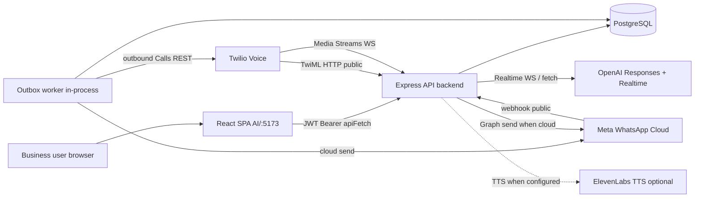
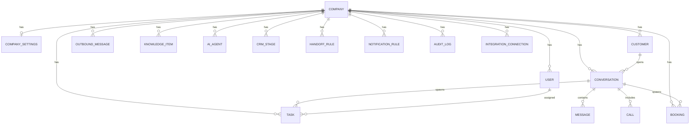
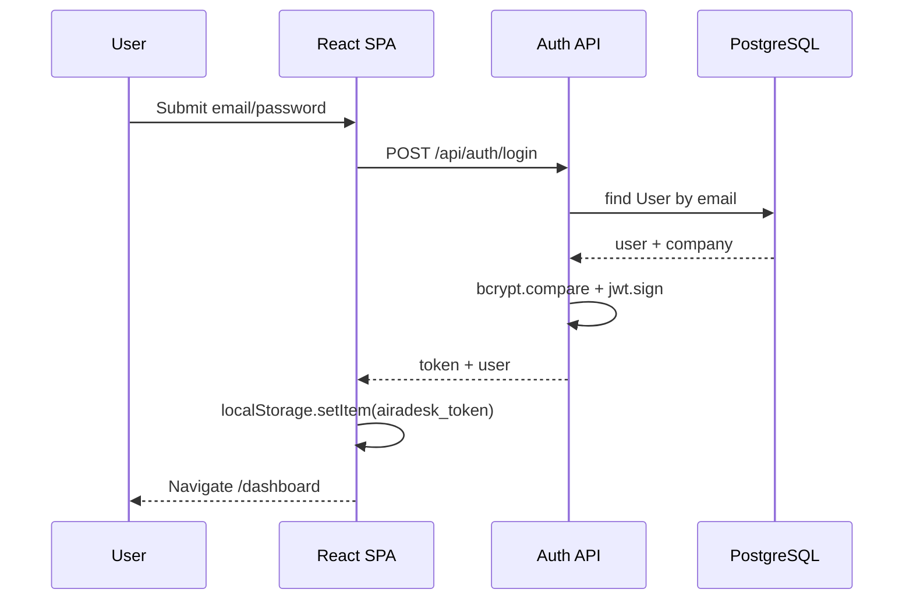
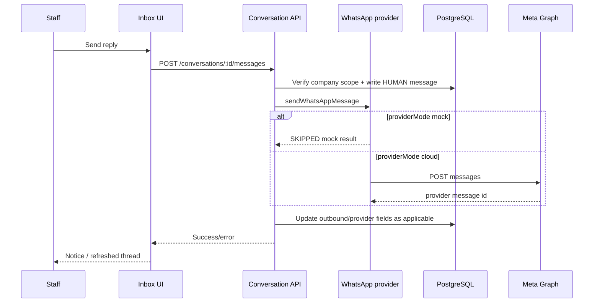
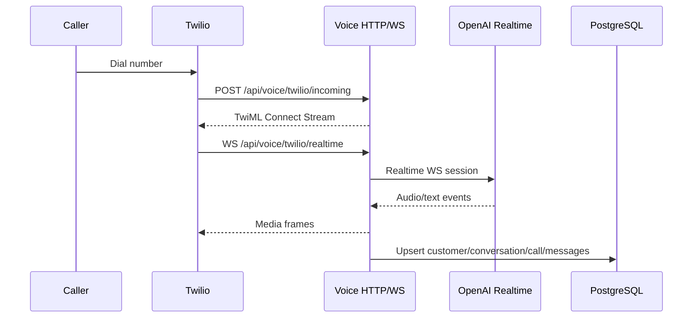
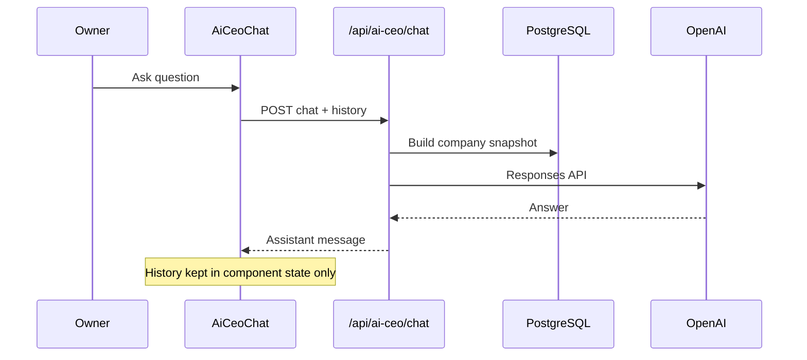
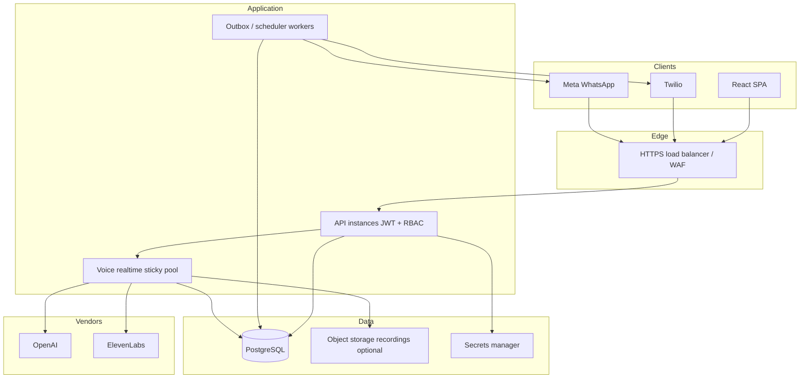

## 2026-07 Hume EVI Update

- Active AI-call runtime for new calls is now `Twilio telephony -> Hume EVI`.
- OpenAI remains active for text and post-call analysis features.
- Historical sections describing Twilio Media Streams + OpenAI Realtime + ElevenLabs are retained as audit history only.
# Technical Architecture

## 1. Architecture summary

| Aspect | Current state |
| ------ | ------------- |
| Application type | Multi-tenant AI communication CRM with realtime voice |
| Shape | **Modular monolith** (single Express process + React SPA); not microservices |
| Frontend | React 19 SPA (Vite 7) in `AI/` |
| Backend | Node.js + Express 5 + TypeScript (`tsx` via nodemon) in `backend/` |
| Database | PostgreSQL via Prisma 7 (`@prisma/adapter-pg` + `pg` Pool) |
| Authentication | bcryptjs passwords + JWT Bearer tokens (7-day expiry) |
| Storage | DB-backed records; call recordings referenced via Twilio URLs/proxy; no first-class object-storage module |
| State management | React local component state + `AuthContext`; no Redux/React Query |
| Deployment model | **Undefined in-repo** (no Dockerfile, no CI, no IaC) — assumes Node host + Postgres + public URL for webhooks/WS |
| External services | OpenAI (Responses + Realtime WS), Twilio Voice/Media Streams/Recordings, Meta WhatsApp Cloud Graph API, optional ElevenLabs TTS |
| Architectural maturity | Advanced prototype: rich domain API and voice engine; weak packaging, security hardening, and ops |

---

## 2. Technology stack

| Layer | Technology | Version | Purpose | Location | Status/Notes |
| ----- | ---------- | ------- | ------- | -------- | ------------ |
| Language (FE) | TypeScript | ~5.9.3 | SPA typing | `AI/package.json` | Active |
| Language (BE) | TypeScript | (lockfile/`tsc`) | API/voice | `backend/` | Active; `tsc --noEmit` currently broken |
| UI | React | 19.2.0 | SPA | `AI/` | Active |
| Routing | react-router | 8.1.0 | Client routes | `AI/src/App.tsx` | Active |
| Build (FE) | Vite | 7.2.4 | Dev/build | `AI/vite.config.ts` | Active; production build currently fails typecheck |
| Plugin | `@vitejs/plugin-react-swc` | 4.2.2 | Fast refresh | `AI/` | Active |
| Styling | Tailwind CSS | 4.3.2 + `@tailwindcss/vite` | Utility CSS | `AI/src/index.css` | Active |
| Icons | lucide-react | 1.23.0 | Icons | pages | Active |
| HTTP API | Express | 5.2.1 | REST + mounts | `backend/src/server.ts` | Active |
| Validation | Zod | 4.4.3 | Request schemas | controllers | Active |
| ORM | Prisma | 7.8.0 | Schema/migrations/client | `backend/prisma/` | Active |
| DB driver | `pg` + `@prisma/adapter-pg` | 8.22.0 / 7.8.0 | Pool | `backend/src/db/prisma.ts` | Active |
| Auth crypto | bcryptjs | 3.0.3 | Password hashes | auth controller | Active |
| Auth tokens | jsonwebtoken | 9.0.3 | JWT | auth middleware | Active |
| WebSockets | `ws` | 8.21.0 | Twilio media stream server | `server.ts` | Active |
| CORS | cors | 2.8.6 | FE origin allowlist | `server.ts` | Active |
| Config | dotenv | 17.4.2 | Env loading | backend entry | Active |
| Dev runner | nodemon + tsx | 3.1.14 / 4.23.0 | Hot reload | `nodemon.json` | Active |
| OpenAI | HTTPS `fetch` + WS | n/a (no SDK) | Text + realtime | services/controllers/voice | Active when key set |
| Twilio | HTTPS `fetch` + TwiML | n/a (no SDK) | Voice/calls | voice + aiScheduledCall | Active when creds set |
| Meta WhatsApp | Graph `fetch` | n/a (no SDK) | Send/receive | whatsappProvider + webhooks | Active in cloud mode |
| ElevenLabs | HTTP/WS stream | n/a (no SDK) | TTS | `backend/src/voice/elevenlabs*` | Optional |
| Forms | Local React state | — | Forms/prompts | pages | No Formik/RHF |
| Client cache | None | — | — | — | Missing shared server-state library |
| Testing | None | — | — | — | Missing |
| Lint (FE) | ESLint 9 | — | Lint | `AI/eslint.config.js` | Currently failing |
| Analytics | None found | — | — | — | Missing |
| Monitoring | console logs + voice perf reports | — | Local | `voice-perf-reports/` | Not production APM |
| Containers | None | — | — | — | Missing |
| CI/CD | None | — | — | — | Missing |

**Note:** `backend/package.json` does not declare dependencies; versions above come from `backend/package-lock.json` / installed modules (**Verified**).

---

## 3. Repository structure

```text
AI Voice Agent/
├── AI/                          # Frontend SPA (Vite + React)
│   ├── src/
│   │   ├── App.tsx              # Route table
│   │   ├── main.tsx             # React entry
│   │   ├── landingpage.tsx      # Authenticated shell + section switch
│   │   ├── commandcenter.tsx    # Dashboard
│   │   ├── inbox.tsx            # Omnichannel inbox
│   │   ├── customers.tsx        # Leads (mounted at /leads)
│   │   ├── tasks.tsx            # Tasks / AI caller
│   │   ├── team.tsx             # Team
│   │   ├── reports.tsx          # Reports
│   │   ├── settings.tsx         # Control room
│   │   ├── aiCeoChat.tsx        # Ask AI CEO
│   │   ├── auth/                # AuthContext, AuthPage, ProtectedRoute
│   │   ├── lib/api.ts           # apiFetch + API_BASE_URL
│   │   └── *.tsx                # Legacy unreachable page modules
│   ├── public/
│   ├── package.json
│   └── vite.config.ts
├── backend/
│   ├── prisma/
│   │   ├── schema.prisma        # Domain model
│   │   ├── migrations/          # SQL migrations
│   │   └── seed/                # demoData.ts, clearData.ts
│   ├── src/
│   │   ├── server.ts            # Express + HTTP + Twilio WS + outbox worker
│   │   ├── middleware/          # JWT auth
│   │   ├── routes/              # Express routers
│   │   ├── controllers/         # HTTP handlers (large files)
│   │   ├── services/            # AI, WhatsApp, outbox, scheduled calls, stubs
│   │   ├── voice/               # Realtime voice engine + perf harness
│   │   └── db/prisma.ts         # Prisma client + pool
│   ├── nodemon.json
│   ├── prisma.config.ts
│   ├── package.json             # ⚠️ scripts-only / incomplete manifest
│   └── voice-perf-reports/      # Generated local reports (gitignored)
├── PRODUCT.md                   # Prior product write-up (partially stale)
├── docs/product-audit/          # This audit set
└── .gitignore                   # Currently empty at repo root
```

**Confusing / mixed-responsibility areas**

* Legacy FE modules coexist with consolidated routes.
* `voice.controller.ts` mixes TwiML, OpenAI, CRM persistence, and streaming (~4.8k lines).
* CRM `voiceProvider` stub vs real Twilio voice path naming collision.
* Hollow `backend/package.json` vs populated lockfile.
* Root documentation (`PRODUCT.md`) not fully aligned with code.

---

## 4. Runtime architecture diagram



**Legend (textual):** Solid arrows are implemented code paths. WhatsApp send is **mocked** when provider mode is `mock`. Email provider, payment processor, and website-chat widget ingress are **missing**. CRM `voiceProvider.service` is a **mocked/unused** side path (not shown as active).

---

## 5. Component and module architecture

| Module | Responsibility | Depends on | Used by | Architecture concerns |
| ------ | -------------- | ---------- | ------- | --------------------- |
| `AI/src/auth` | Session + login UI | `lib/api` | App shell | Token in localStorage |
| `landingpage.tsx` | Shell/nav | Section pages | App routes | UI-only header controls |
| Page modules (`inbox`, `customers`, …) | Feature UI | `apiFetch` | LandingPage | Very large files; duplicated legacy |
| `lib/api.ts` | HTTP client | `VITE_API_BASE_URL` | All pages | Default port 5001 |
| `routes/*` | HTTP path wiring | controllers, authMiddleware | `server.ts` | Thin / consistent |
| `controllers/*` | Request handling + much business logic | prisma, zod, services | routes | Fat controllers; weak layering |
| `services/*` | AI/WhatsApp/outbox/voice helpers | prisma, env, fetch | controllers/worker | Mixed maturity |
| `voice/*` | Realtime audio pipeline | OpenAI/ElevenLabs/Twilio framing | voice controller | Complex; good candidate for isolation |
| `middleware/auth` | JWT verify | `JWT_SECRET` | Most routes | No RBAC helper |
| `db/prisma` | DB client | `DATABASE_URL` | everywhere | Pool env tuning present |
| `prisma/schema` | Domain model | PostgreSQL | Prisma client | Solid baseline |

---

## 6. Frontend architecture

### Routing & layouts

* `BrowserRouter` in `App.tsx`
* Public: `/login`
* Protected: all workspace routes wrap `LandingPage` in `ProtectedRoute`
* `LandingPage` maps `pathname` → `activeSection` → page component

### State

* Auth: React context
* Server data: per-page `useState` + `useEffect` fetch (no shared cache, no React Query)
* Forms: local state; some `window.prompt` flows on leads

### Data fetching

* Primary: `apiFetch` with Bearer token
* Exceptions: authenticated `fetch` for recording media blobs

### Auth UX

* Loading gate in `ProtectedRoute`
* No route-level role checks
* No logout control in shell

### Styling / a11y / responsive

* Tailwind utility-first dark UI
* Responsive grids; sidebar at `xl`
* Accessibility attributes largely absent
* No design-system package; repeated local input helpers inside page files

### Performance techniques

* Vite/SWC
* No evidence of route-based code splitting beyond Vite defaults
* Large monolithic page bundles likely

### How data reaches screens (examples)

* Dashboard: mount → `GET /api/dashboard/summary`
* Inbox: querystring filters → `GET /api/conversations/inbox` → detail `GET /api/conversations/:id`
* Settings: `GET /api/settings/control-room` then PATCH/POST section endpoints

---

## 7. Backend and API architecture

### Style

* REST JSON over Express
* Webhooks as public HTTP
* Twilio Media Streams as WebSocket on same HTTP server
* Background work via **in-process interval worker** (not a separate queue product)

### Layering (actual)

```text
routes → controllers (validation + orchestration + persistence) → prisma
                 ↘ services (AI/WhatsApp/outbox/voice helpers)
```

There is no distinct repository layer. Authorization beyond JWT is ad hoc.

### API inventory (representative; full mounts in `server.ts`)

| Method | Endpoint/Action | Purpose | Auth required | Roles | Input validation | Data source | Used by UI | Status |
| ------ | --------------- | ------- | ------------- | ----- | ---------------- | ----------- | ---------- | ------ |
| POST | `/api/auth/register` | Create tenant+owner | No | Public | Zod | Prisma | AuthPage | Active |
| POST | `/api/auth/login` | Issue JWT | No | Public | Zod | Prisma | AuthPage | Active |
| GET | `/api/auth/me` | Session user | JWT | Any | — | Prisma | AuthContext | Active |
| GET | `/api/dashboard/summary` | Owner snapshot | JWT | Any | — | Prisma aggregates | CommandCenter | Active |
| GET | `/api/conversations/inbox` | Inbox list | JWT | Any | Query schema | Prisma | Inbox | Active |
| POST | `/api/conversations/:id/messages` | Human reply | JWT | Any | Body | Prisma + WA provider | Inbox | Active |
| POST | `/api/conversations/:id/actions` | CRM actions | JWT | Any | Action enum | Prisma | Inbox | Active |
| GET/POST | `/api/customers/leads` | Leads | JWT | Any | Zod | Prisma | CustomersPage | Active |
| GET | `/api/tasks/operations` | Task board | JWT | Any | Query | Prisma | Tasks | Active |
| POST | `/api/tasks/ai-call` | Schedule AI call | JWT | Any | Zod | Prisma | Tasks | Active |
| GET | `/api/team/overview` | Team view | JWT | Any | — | Prisma | Team | Active |
| POST | `/api/team/invite` | Invite member | JWT | OWNER/ADMIN | Zod | Prisma | Team | Active |
| GET | `/api/reports/overview` | BI | JWT | Any | Query | Prisma | Reports | Active |
| GET | `/api/settings/control-room` | Settings aggregate | JWT | Any | — | Prisma | Settings | Active |
| PATCH | `/api/settings/*` | Settings updates | JWT | Mixed | Zod | Prisma | Settings | Active |
| GET/PATCH | `/api/whatsapp-integration` | WA config | JWT | Any | Zod | Prisma | Settings | Active |
| POST | `/api/ai-ceo/chat` | AI CEO | JWT | Any | Body | Prisma + OpenAI | AiCeoChat | Active |
| POST | `/api/webhooks/meta/whatsapp` | WA inbound | Public | — | Meta payload | Prisma + AI services | External | Active / weakly authenticated |
| POST | `/api/voice/twilio/incoming` | Inbound call TwiML | Public | — | Twilio form | Voice stack | Twilio | Active / unsigned |
| WS | `/api/voice/twilio/realtime` | Media bridge | Public | — | Stream protocol | OpenAI/EL/DB | Twilio | Active |
| POST | `/api/voice/twilio/outbound-ai` | Start outbound | JWT | Any | Body | Twilio | Calls/Leads/Tasks paths | Active |

Additional CRUD exists for agents, bookings, outbound, knowledge, pipeline, handover, analytics, integrations secret rotate, AI provider status/reply/realtime secret — all JWT unless noted.

---

## 8. Data architecture

### Database technology

* PostgreSQL
* Prisma schema: `backend/prisma/schema.prisma`
* Migrations under `backend/prisma/migrations/`
* Seed: `backend/prisma/seed/demoData.ts` (optional; not npm-scripted in current package.json)
* Clear: `backend/prisma/seed/clearData.ts` (destructive local tool)

### Entity table (core)

| Entity | Purpose | Key fields | Relationships | Created by | Read by | Updated by | Deleted by |
| ------ | ------- | ---------- | ------------- | ---------- | ------- | ---------- | ---------- |
| Company | Tenant | name, industry | Owns all tenant data | Register | JWT APIs | Settings | Cascade via admin tools / clear seed |
| User | Staff account | email unique, role, permissions JSON | Company; assigned Tasks | Register/invite | Auth/team | Team/settings | Deactivate (soft via isActive) |
| CompanySettings | Tenant config | channels, AI, WA/voice secrets, JSON blobs | 1:1 Company | Upsert on use/seed | Settings/integrations | Settings | Cascade |
| Customer | Lead/contact | phone, email, leadStage, scores | Conversations/tasks/bookings | Inbound + UI | Leads/inbox | Lead actions | Cascade with company |
| Conversation | Thread | channel, status, priority, AI fields | Messages/calls/tasks | Inbound + UI | Inbox | Actions | DELETE conversation API |
| Message | Turn | senderType, body, provider ids | Conversation | Inbound/AI/human | Detail views | Provider status updates | Cascade |
| Call | Phone record | status, transcript, recording fields | Conversation | Voice flows | Inbox/calls APIs | Status/recording webhooks | Cascade |
| Task | Work item | status, priority, dueAt, owner, aiNotes | Company/customer/conversation/user | AI/UI | Tasks | Actions/UI | DELETE task |
| Booking | Appointment | title, dateTime, status | Customer/conversation | AI/UI | Leads/legacy bookings | Status updates | Cascade |
| OutboundMessage | Send queue | channel, toPhone, body, status | Company/conversation | AI/human flows | Outbox APIs/worker | Worker/provider | Cascade |
| KnowledgeItem | Grounding content | title, category, content | Company | Settings | AI paths/settings | Settings | Settings delete |
| AiAgent | Channel bot config | channel, status, instructions | Company | Seed/settings/agents API | Team/settings/legacy | Agents API | Cascade |
| CrmStage | Pipeline config | name, order, automation JSON | Company | Settings | Settings/reports | Settings | Settings delete |
| HandoffRule | Escalation config | condition, action | Company | Settings | Settings | Settings | Settings delete |
| NotificationRule | Alert config | event, recipients JSON | Company | Settings | Settings | Settings | Settings delete |
| AuditLog | Control-room audit | action, entity, message | Company | Settings mutations | Control room | Append-only | Cascade |
| IntegrationConnection | Provider status rows | provider, status, metadata | Company | Integration flows | Settings/health | Integration updates | Cascade |

### ER diagram



### Data integrity notes

* Strong `companyId` indexing across tenant tables (**Verified**).
* Soft delete for users via `isActive` / `deactivatedAt`; hard deletes elsewhere.
* Booking `status` is free-form string default `REQUESTED` (weaker than enums).
* Customer `leadStage` string vs `CrmStage` table — dual models risk drift.
* No explicit multi-region / sharding strategy.
* Voice ingress may write into wrong tenant if `VOICE_COMPANY_ID` unset (falls back to oldest company) — **High integrity risk**.

---

## 9. Authentication and authorization architecture

### Mechanisms

* Registration creates Company + OWNER
* Login compares bcrypt hash
* JWT claims: `userId`, `companyId`, `role`, `industry?`
* Expiry: 7 days; no refresh token flow found
* Client storage: `localStorage.airadesk_token`
* Middleware: Bearer required; sets `req.user`
* RBAC: OWNER/ADMIN checks in team/settings mutation controllers only
* Account recovery: admin reset password endpoint; no self-service email reset
* Email verification: Missing
* Account deletion: Missing productized flow (deactivate exists for members)

### Sequence (login)



### Known security gaps (summary)

* JWT in localStorage
* No global permission middleware
* Public Twilio/Meta webhooks without signature validation
* Weak WhatsApp company resolution fallbacks
* Env-global voice company mapping
* Tracked `AI/.env` in git

---

## 10. Data-flow diagrams for major features

### Human WhatsApp reply



### Inbound realtime call (simplified)



### AI CEO



---

## 11. Third-party integrations

| Integration | Purpose | Files used | Environment variables | Current status | Failure handling | Production concerns |
| ----------- | ------- | ---------- | --------------------- | -------------- | ---------------- | ------------------- |
| PostgreSQL | System of record | `db/prisma.ts`, schema | `DATABASE_URL`, `PG_*` | Active | Startup/query errors | Backups/HA not defined |
| OpenAI Responses | Decisions, AI CEO, legacy speech text | `llmDecision.service.ts`, `aiCeo.controller.ts`, `aiProvider.controller.ts`, voice | `OPENAI_API_KEY`, `OPENAI_MODEL`, `OPENAI_TEXT_MODEL`, `OPENAI_DECISION_TIMEOUT_MS` | Active when keyed; else fallback/error | Rule fallback / explicit errors | Cost, rate limits, prompt injection |
| OpenAI Realtime | Voice agent | `voice.controller.ts`, voice engine | `OPENAI_REALTIME_MODEL`, `OPENAI_REALTIME_VOICE`, … | Active in code | Connection errors logged | Latency/cost; model availability |
| Twilio Voice | Telephony | voice controller, `aiScheduledCall.service.ts` | `TWILIO_*`, `PUBLIC_WEBHOOK_URL`, `VOICE_FROM_NUMBER` | Active in code | Task/call failure fields | Signature validation missing |
| Meta WhatsApp Cloud | Messaging | `whatsappProvider.service.ts`, webhook + integration controllers | `WHATSAPP_*`, settings fields | Active in cloud mode; default mock | Skip/error messages | Signature validation missing; tenancy fallbacks |
| ElevenLabs | TTS | `voice/elevenlabs*.ts`, config | `ELEVENLABS_*`, `VOICE_TTS_PROVIDER` | Optional active when key present | Falls back to OpenAI audio path | Extra vendor dependency |
| Email provider | Invites/notifications | — | `EMAIL_*` in env only | Configured but unused | N/A | Remove or implement |
| Payments | Revenue | Dashboard/reports/AI CEO stubs | billingSettings JSON | Missing / honest stub | Shows “not connected” | Needed for commercial SaaS |
| Website chat widget | Channel | Schema enums only | — | Missing ingress | N/A | Decide v1 scope |
| CRM voiceProvider stub | Abstraction | `voiceProvider.service.ts` | settings voiceProvider* | Mocked / unused | Throws if non-mock | Delete or replace to avoid confusion |

---

## 12. Environment and configuration architecture

| Variable | Used in | Required | Client/server exposure | Fallback | Validation | Notes |
| -------- | ------- | -------- | ---------------------- | -------- | ---------- | ----- |
| `DATABASE_URL` | Prisma pool | Yes for backend | Server | None | Missing startup schema validation beyond Prisma | Required |
| `JWT_SECRET` | Auth | Yes for auth | Server | Throws if missing on sign/verify path | Present check | Required |
| `PORT` | `server.ts` | No | Server | `5000` | — | Local env may use `5001` |
| `FRONTEND_URL` | CORS | No | Server | `http://localhost:5173` | — | Must match deployed FE origin |
| `NODE_ENV` | Prisma logging etc. | No | Server | — | — | |
| `PUBLIC_WEBHOOK_URL` | Twilio/WA webhook URLs | Yes for live telephony/WA | Server | Empty → broken public callbacks | Normalize helpers | Critical for integrations |
| `OPENAI_API_KEY` | AI + voice | Yes for AI features | Server | Empty → degraded/errors | Placeholder detection in places | |
| `OPENAI_MODEL` / `OPENAI_TEXT_MODEL` | Text models | No | Server | `gpt-4o-mini` | — | |
| `OPENAI_DECISION_TIMEOUT_MS` | LLM decision | No | Server | `12000` | — | |
| `OPENAI_REALTIME_MODEL` / `OPENAI_REALTIME_VOICE` | Voice | No | Server | coded defaults | — | |
| `TWILIO_ACCOUNT_SID` / `TWILIO_AUTH_TOKEN` / `TWILIO_PHONE_NUMBER` | Voice/outbound | Yes for calls | Server | Empty → cannot place/handle properly | — | |
| `VOICE_FROM_NUMBER` | Alternate from | No | Server | Falls back from Twilio number | — | |
| `VOICE_COMPANY_ID` | Inbound tenant | Effectively yes for multi-tenant | Server | Oldest company fallback | Dangerous fallback | |
| `VOICE_BUSINESS_NAME` / `TYPE` / `GREETING` / `PRICING_MENU` | Voice copy | No | Server | Kadam Web Design defaults | Hardcoded demo | Move to CompanySettings |
| `VOICE_LOCAL_VAD_*`, `VOICE_ECHO_*`, barge-in envs | Voice UX | No | Server | Coded defaults | — | Tuning knobs |
| `ELEVENLABS_*` | TTS | No | Server | Disabled if missing | Auto-enable heuristics | |
| `VOICE_TTS_PROVIDER` | TTS selection | No | Server | — | — | |
| `WHATSAPP_PROVIDER_MODE` | Global mode hint | No | Server/settings | mock | — | Per-company settings also exist |
| `WHATSAPP_CLOUD_TOKEN` / phone/WABA/verify/graph version | WA | For cloud | Server | — | — | Also stored on CompanySettings |
| `WHATSAPP_DEFAULT_COMPANY_ID` | Webhook mapping fallback | No | Server | First settings row risk | — | Multi-tenant hazard |
| `OUTBOX_WORKER_ENABLED` / `INTERVAL_MS` / `BATCH_LIMIT` | Worker | No | Server | enabled unless `false`; 30s; 20 | — | |
| `PG_CONNECTION_TIMEOUT_MS` / `PG_IDLE_TIMEOUT_MS` / `PG_POOL_MAX` / `PG_MAX_USES` | Pool | No | Server | Defaults in prisma.ts | — | |
| `VOICE_PERF_REPORT_DIR` | Perf harness | No | Server | default dir | — | Dev |
| `VITE_API_BASE_URL` | FE API base | Recommended | **Client** | `http://localhost:5001` | — | Must point at API; tracked file risk |
| `EMAIL_*` | — | No | Server env only | — | Unused in src | Dead config |
| `APP_PUBLIC_URL` | Present in env | Unverified usage breadth | Server | — | — | Confirm vs `PUBLIC_WEBHOOK_URL` |

**Environment separation:** No staging/prod config files or validation layer found. Dev relies on local `.env`.

**Unsafe client exposure:** Only `VITE_*` should be client-visible; currently just API base URL (**Verified** pattern). Backend secrets must remain server-only.

---

## 13. Build, test, and deployment architecture

### Commands

| Area | Command | Purpose |
| ---- | ------- | ------- |
| FE dev | `cd AI && npm run dev` | Vite dev server |
| FE build | `cd AI && npm run build` | `tsc -b && vite build` |
| FE lint | `cd AI && npm run lint` | ESLint |
| FE preview | `cd AI && npm run preview` | Preview build |
| BE dev | `cd backend && npm run dev` | nodemon → `tsx src/server.ts` |
| BE typecheck | `cd backend && npx tsc --noEmit` | Manual (no script) |
| DB | Prisma CLI via `npx prisma …` | Not scripted in current package.json |
| Seed | `npx tsx prisma/seed/demoData.ts` (manual) | Optional demo company |

### Validation results (2026-07-24)

| Command | Result | Errors/Warnings | Interpretation |
| ------- | ------ | --------------- | -------------- |
| `AI`: `npm run lint` | **Failed** (exit 1) | 54 errors, 15 warnings | Hook lint rules / deps issues across pages |
| `AI`: `npm run build` | **Failed** (exit 2) | ~43 TS errors | Type-only import + unused symbol + at least one real type error in legacy `calls.tsx` |
| `backend`: `npx tsc --noEmit` | **Failed** (exit 2) | ~781 TS errors | `verbatimModuleSyntax` vs missing ESM package type; widespread module errors |
| Automated tests | **Not run / none exist** | — | No test runner configured |
| Live Twilio/Meta/OpenAI E2E | **Not executed** | — | Avoided chargeable/destructive external calls |

### Deployment

* No Docker, Kubernetes, Render/Fly/Railway configs, or GitHub Actions found.
* Runtime assumption: long-lived Node process (because WS + interval worker are in-process).
* Rollback / health: `/health` exists but no orchestrated probes documented.

---

## 14. Error handling and observability

| Concern | Current state |
| ------- | ------------- |
| Client errors | `apiFetch` throws `Error(message)`; pages set error/notice strings |
| API errors | Mostly try/catch → JSON `{ message }` with HTTP codes |
| Global FE error boundary | Not found |
| Structured logging | Mostly `console.log/error` |
| Monitoring/APM | Missing |
| Alerting | Missing |
| Tracing | Missing |
| Analytics | Missing |
| Crash reporting | Missing |
| Audit logging | `AuditLog` for some settings actions |
| Voice performance | Local report writer under `voice/performance` |
| Retry | Limited/provider-specific; no general resilience framework |
| Fallback | AI rules fallback; WA mock skip; payments disconnected messages |

**Missing for production:** centralized logger, request IDs, metrics, error tracking (e.g. Sentry), uptime alerts, queue failure alerts.

---

## 15. Security architecture

### Findings

```text
Finding: Public Meta WhatsApp inbound webhook lacks app secret / HMAC signature verification
Severity: Critical
Evidence: backend/src/controllers/webhook.controller.ts; no X-Hub-Signature validation found
Impact: Forged inbound messages; possible cross-tenant pollution depending on routing fallbacks
Recommended remediation: Verify Meta signatures; reject unverified payloads; remove unsafe company fallbacks
```

```text
Finding: Twilio voice webhooks/WS lack Twilio signature validation
Severity: Critical
Evidence: voice routes public; no validateRequest usage found
Impact: Call flow abuse, TwiML injection, unauthorized outbound triggers if endpoints guessable
Recommended remediation: Validate Twilio signatures using auth token; restrict by source where possible
```

```text
Finding: Inbound voice tenant selection via VOICE_COMPANY_ID or oldest company
Severity: Critical
Evidence: getVoiceCompany pattern in voice.controller.ts
Impact: Cross-tenant data writes in multi-company deployments
Recommended remediation: Map Twilio To/From / number SIDs to company in DB; fail closed if unmapped
```

```text
Finding: WhatsApp company resolution can fall back to WHATSAPP_DEFAULT_COMPANY_ID or first settings row
Severity: High
Evidence: webhook.controller.ts env fallbacks
Impact: Misattributed conversations across tenants
Recommended remediation: Strict phone_number_id → company unique mapping only
```

```text
Finding: RBAC is incomplete; STAFF JWT can call most CRM APIs; permissions JSON not enforced
Severity: High
Evidence: auth.middleware.ts has no role checks; team/settings only
Impact: Privilege escalation within tenant; settings exposure
Recommended remediation: Central authorization middleware + ownership checks + FE route gates
```

```text
Finding: JWT stored in localStorage
Severity: Medium
Evidence: AuthContext + api.ts
Impact: XSS can exfiltrate session
Recommended remediation: Harden CSP/XSS; consider httpOnly secure cookies for web sessions
```

```text
Finding: AI/.env tracked in git
Severity: High (process/secret hygiene)
Evidence: git ls-files shows AI/.env
Impact: Future secret leakage; config drift in VCS
Recommended remediation: Remove from git history if needed; add to gitignore; use example env files
```

```text
Finding: Weak password policy (min 6) and long-lived JWT (7d) without revocation
Severity: Medium
Evidence: auth.controller.ts
Impact: Credential stuffing / stolen token window
Recommended remediation: Stronger policy, refresh tokens, server-side revocation, lockouts
```

```text
Finding: No rate limiting on auth or webhooks
Severity: Medium
Evidence: server.ts middleware stack
Impact: Brute force / webhook floods
Recommended remediation: Rate limit + WAF basics
```

```text
Finding: CORS locked to FRONTEND_URL (good) but trust proxy enabled
Severity: Informational / Medium depending on deploy
Evidence: server.ts trust proxy true
Impact: IP spoofing if proxy not configured correctly
Recommended remediation: Configure trusted proxy hops explicitly
```

---

## 16. Performance and scalability

### Confirmed / code-evident

* Voice path includes local VAD, latency tracking, and a performance harness — positive signal for voice latency focus.
* In-process outbox worker + WebSocket voice **tie scaling to sticky single instance** unless redesigned.
* Large controllers/pages increase maintainability cost more than runtime cost initially.
* FE build currently fails — production asset pipeline not green.

### Possible future concerns (Inferred)

* Inbox/list endpoints may need stricter pagination defaults under load.
* N+1 risks in rich includes across dashboard/reports (needs query review under real data).
* OpenAI/Twilio fan-out costs and concurrency limits.
* No CDN/cache strategy defined for SPA.
* Recording media proxying through API may become bandwidth bottleneck.

---

## 17. Architecture strengths

* Clear multi-tenant `companyId` modeling with indexes (**Verified** schema).
* Zod validation on many mutating endpoints.
* Honest disconnected payments rather than fake metrics.
* Separation of SPA and API with explicit CORS origin.
* Substantial realtime voice engineering with configurable VAD/TTS.
* Consolidated workspace IA (Inbox/Leads/Tasks/…) reduces product fragmentation vs older modules.
* Outbox pattern for outbound WhatsApp and scheduled calls.
* AI CEO grounded on DB snapshot with instructions not to invent payments.

---

## 18. Architecture weaknesses and technical debt

| Issue | Area | Severity | Evidence | Impact | Recommended direction |
| ----- | ---- | -------- | -------- | ------ | --------------------- |
| Hollow backend package.json | Tooling | High | `backend/package.json` | Broken onboarding/CI | Restore full manifest + scripts |
| FE/BE typecheck failures | Quality | High | lint/build/tsc results | Cannot ship confidently | Fix module/type imports; add CI gate |
| Fat voice controller | Voice | High | ~4869 LOC file | Hard to secure/test | Split TwiML, session, persistence |
| Legacy FE duplication | Frontend | Medium | orphaned `*.tsx` modules | Drift/bugs | Delete or archive after parity check |
| In-process worker + WS | Scalability | High | `server.ts` | Horizontal scale pain | Extract worker; sticky sessions or socket layer |
| Mock/cloud ambiguity | Integrations | Medium | WA mode + unused voiceProvider | Operator mistakes | Prod config guards |
| Dual lead stage models | Data | Medium | Customer.leadStage vs CrmStage | Reporting inconsistency | Single source of truth |
| Missing tests/CI/observability | Ops | High | repo scan | Regressions, blind prod | Add foundational DevOps |
| Stale PRODUCT.md | Docs | Low | mismatches | Wrong runbooks | Treat audit docs as SoT; refresh PRODUCT.md later |

---

## 19. Recommended target architecture

> **Recommendation only — not the current state.**

Prefer **incremental hardening of the modular monolith** over a rewrite. The domain already fits a single deployable API + SPA + managed Postgres, with an extracted background worker when scale demands it.

### Target principles

* Keep Express+Prisma+React unless scaling forces extraction
* Introduce explicit modules: `auth`, `tenancy`, `inbox`, `crm`, `tasks`, `channels/whatsapp`, `channels/voice`, `ai`, `settings`, `billing`
* Move channel secrets and voice personas fully into per-company settings
* Fail closed on webhook auth and tenant mapping
* Add queue (e.g. Postgres-backed or Redis) for outbox if multi-instance
* Put realtime voice on sticky sessions or dedicated voice service only when needed
* Standardize FE data layer (React Query) and shared UI primitives
* CI: typecheck, lint, unit/integration, migrate-on-deploy, Sentry, structured logs



### Testing / deploy topology (target)

* Dev / Staging / Prod env separation with validated env schemas
* PR checks: lint, typecheck, unit, migration dry-run
* Staging connected to Twilio/Meta sandbox numbers
* Prod: managed Postgres backups, error tracking, metrics, alerts, runbooks

---

*End of Technical Architecture audit.*
