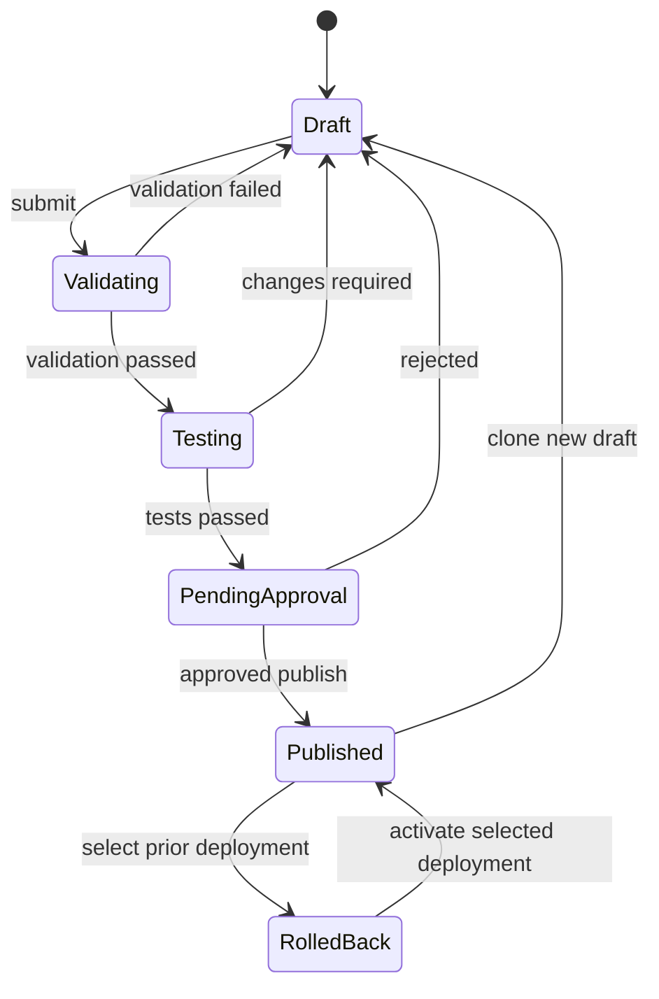

# 01 — Latest Product Definition

## 1. Document purpose and authority

| Field | Value |
| ----- | ----- |
| Audit / definition date | 2026-07-24 |
| Repository branch | `main` |
| Commit hash | `2d9b2cdd9ab2a27821cdfcaea8dbe409eb046a10` |
| Product name in code/UI | **AiraDesk** |

### Documents reviewed

| Document | Status |
| -------- | ------ |
| `docs/product-audit/01_PRODUCT_CURRENT_STATE.md` | Reviewed completely — **AUDIT-VERIFIED** |
| `docs/product-audit/02_TECHNICAL_ARCHITECTURE.md` | Reviewed completely — **AUDIT-VERIFIED** |
| `docs/product-audit/03_PRODUCTION_READINESS_PLAN.md` | Reviewed completely — **AUDIT-VERIFIED** |
| `PRODUCT.md` | Reviewed — partially **stale** vs code (**CONFLICT** recorded in `04_EVIDENCE_CONFLICTS_AND_DECISIONS.md`) |
| `airadesk-platform/README.md` | Reviewed — **PLANNING-CONFIRMED** (platform direction) |
| `airadesk-platform/ARCHITECTURE.md` | Reviewed — **PLANNING-CONFIRMED** |
| `airadesk-platform/DOMAIN_MODEL.md` | Reviewed — **PLANNING-CONFIRMED** |
| `airadesk-platform/MODULE_BOUNDARIES.md` | Reviewed — **PLANNING-CONFIRMED** |
| `airadesk-platform/MIGRATION_STRATEGY.md` | Reviewed — **PLANNING-CONFIRMED** |
| `airadesk-platform/IMPLEMENTATION_BACKLOG.md` | Reviewed — **PLANNING-CONFIRMED** |
| `pipeline-reference/README.md`, `SOURCE_MAP.md`, `PIPELINE_CONTRACTS.md`, `EXTRACTION_PLAN.md`, `PIPELINE_INVENTORY.md` | Reviewed — behavioural reference |
| Confirmed product direction in the master planning prompt | Treated as **PLANNING-CONFIRMED** latest intended product |

### Source directories reviewed

| Path | Exists | Notes |
| ---- | ------ | ----- |
| `AI/` | Yes | Demo frontend SPA |
| `backend/` | Yes | Demo API, voice, webhooks, Prisma |
| `docs/product-audit/` | Yes | Three audit files |
| `docs/product-planning/` | **No** | Folder does not exist — recorded explicitly |
| `docs/product-blueprint/` | Created by this task | This document set |
| `pipeline-reference/` | Yes | Docs + empty fixture/contract stubs (`.gitkeep`) |
| `airadesk-platform/` | Yes | Scaffold + planning docs; apps/packages are empty placeholders |
| `PRODUCT.md` | Yes | Prior product write-up; not authoritative when conflicting with code |

### Product direction used

The **confirmed product direction** in the master planning prompt (generic multi-tenant AI front-desk / communication CRM; industry packs; Twilio voice + Meta WhatsApp; fail-closed channel tenancy; draft→publish AI lifecycle) is treated as the **latest intended product**.

Current demo code (`AI/`, `backend/`) is authoritative for **what exists today**.  
Approved planning (`airadesk-platform/*`, this blueprint, confirmed prompt direction) is authoritative for the **target product**.

### Limitations

* Live Twilio, Meta WhatsApp, and OpenAI Realtime sessions were **not** executed for this blueprint (**Unverified live**).
* No automated test suite exists in the demo (**CODE-VERIFIED** absence).
* `airadesk-platform` application code is not implemented yet — only folder scaffold and planning docs (**CODE-VERIFIED**).
* Billing / commercial model is **not** confirmed (**UNKNOWN**).
* Exact pilot tenant count and commercial commitments are **UNKNOWN**.

### What this document controls

* The **latest product definition** AiraDesk is intended to become.
* Shared vocabulary for feature scope, architecture layers, and industry-pack behaviour.
* Distinctions between confirmed, proposed, deferred, rejected, and unknown items.

### What it does not control

* Implementation commits or source changes.
* Pricing, contracts, or legal compliance certification.
* Vendor account setup (Twilio/Meta/OpenAI).
* Timeline or cost estimates (none provided without measurement sources).

---

## 2. Executive product definition

**What AiraDesk is**  
AiraDesk is a **generic, multi-tenant AI front-desk and communication CRM platform**. One production application and codebase serves client companies across industries. It answers and qualifies enquiries on **voice** and **WhatsApp**, writes structured CRM work (contacts, opportunities/leads, conversations, tasks, appointments), supports **human takeover**, and gives operators operational dashboards and an AI ops assistant grounded on tenant data.

**Who buys it**  
Operators of enquiry-driven or appointment-driven businesses (and, eventually, a SaaS platform operator who provisions those tenants). Buyer identity and commercial packaging are **UNKNOWN** beyond “service businesses” evidenced in UI/industry enum and confirmed multi-industry direction.

**Who uses it**

| Actor | Evidence |
| ----- | -------- |
| Client company OWNER / ADMIN / STAFF | **SCHEMA-VERIFIED** `UserRole`; **CODE-VERIFIED** auth/team/settings |
| End customer / caller / WhatsApp sender | **CODE-VERIFIED** voice + webhook ingress paths |
| Human agent receiving handoff | **CODE-VERIFIED** `TAKE_OVER` / handover queue paths |
| SaaS platform operator | **PLANNING-CONFIRMED** target persona; **Missing** as a distinct product surface in demo |

**Business problem**  
Service businesses lose or mishandle phone/WhatsApp enquiries; teams lack a single company-scoped ops view that combines AI front-desk handling with CRM writeback and human escalation (**AUDIT-VERIFIED** + feature set).

**What makes it generic**  
Industry differences are delivered as **configuration** (industry solution packs + tenant brain config + custom fields), not separate applications or code forks (**PLANNING-CONFIRMED**).

**Configured per company**  
Identity, brand voice, greeting, languages, hours, locations/services/products knowledge, qualification fields, CRM stages, workflows, appointment rules, escalation/handoff, allowed/prohibited AI actions, integrations, voice settings, reporting preferences, and published AI deployment versions (**PLANNING-CONFIRMED**; partial equivalents in demo `CompanySettings`, `KnowledgeItem`, `CrmStage`, `AiAgent`, handoff/notification rules — **SCHEMA-VERIFIED** / **CODE-VERIFIED**).

**Common across all companies**  
Platform core entities, auth, tenancy/channel-endpoint resolution, provider adapters, inbox/CRM/task/appointment capabilities, workflow engine, agent draft/publish lifecycle, audit, worker/outbox, observability (**PLANNING-CONFIRMED**).

**Current maturity**  
```text
Demo / advanced prototype (AI/ + backend/) + empty production scaffold (airadesk-platform/)
```
**AUDIT-VERIFIED** classification: not ready for untrusted multi-tenant production traffic.

**Target release type**  
Closed **pilot** of the production platform after security, tenancy, and two-industry proof gates — not a public marketplace launch (**PROPOSED** / aligned with audit Phase 5 and platform backlog). Commercial SKU naming is **UNKNOWN**.

---

## 3. Product principles

| Principle | Definition for AiraDesk | Evidence / status |
| --------- | ----------------------- | ----------------- |
| One codebase | One production app serves all industries via config | **PLANNING-CONFIRMED** |
| Strong tenant isolation | Every business row scoped by `companyId`; channel endpoints unique to one company | Demo JWT APIs largely scoped (**CODE-VERIFIED** current-state); ingress fallbacks violate this (**CODE-VERIFIED** Unsafe) — must be fixed in production |
| Configuration over code forks | Industry behaviour via packs + custom fields | **PLANNING-CONFIRMED**; demo uses `Industry` enum heuristics only (**PARTIALLY-VERIFIED**) |
| Industry packs over separate apps | Packs are versioned templates | **PLANNING-CONFIRMED**; not implemented in demo |
| Controlled AI tools | Typed tools via domain services; no unrestricted DB mutation from models | **PLANNING-CONFIRMED**; demo mixes controller/service writes (**CODE-VERIFIED**) |
| Draft / test / publish AI lifecycle | Immutable `AgentDeployment`; no silent mid-call mutation of live brain | **PLANNING-CONFIRMED**; demo `AiAgent` lacks draft/publish (**SCHEMA-VERIFIED** gap) |
| Human takeover | Explicit TAKE_OVER / RETURN_TO_AI | **CODE-VERIFIED** conversation/handover paths |
| Auditability | Append-only audit events for sensitive ops | Demo `AuditLog` for some settings (**SCHEMA-VERIFIED**); incomplete coverage (**AUDIT-VERIFIED**) |
| Fail-closed provider routing | Unknown channel endpoints never write | **PLANNING-CONFIRMED**; demo fails open to oldest/first company (**CODE-VERIFIED** CONFLICT) |
| Incremental modular monolith | `web` + `api` + `worker` + **Supabase PostgreSQL**; extract voice only with evidence | **PLANNING-CONFIRMED** (ADR-001/003) |
| No fake production features | No mock “success” in prod; no fake revenue | Demo honestly disconnects payments (**CODE-VERIFIED**); WhatsApp defaults to mock (**CODE-VERIFIED** — must fail closed in prod) |

---

## 4. Product layers

| Layer | Purpose | Shared or tenant-specific | Existing evidence | Target responsibility |
| ----- | ------- | ------------------------- | ----------------- | --------------------- |
| Platform core | Tenancy, auth, domain entities, APIs, worker, DB | Shared code; tenant-scoped data | Demo Express+Prisma+JWT (**current-state**); platform scaffold packages | `airadesk-platform` apps + `domain`/`database`/`tenancy`/`auth`; target DB = Supabase PostgreSQL via Prisma; target auth = opaque sessions (**ADR-002/003**) |
| Reusable capabilities | Inbox, CRM, tasks, appointments, knowledge, handoff, reports | Shared capabilities; tenant data | Demo controllers/UI | Domain services + `apps/api`/`apps/web` |
| Industry solution packs | Defaults: fields, stages, workflows, agent starter, reports, tests | Shared pack catalog; installed per tenant | **Missing** in demo; planned in `packages/industry-packs` | Pack install → `TenantPackInstallation` |
| Tenant configuration | Company brain, channels, hours, knowledge, stages, rules | Tenant-specific | `CompanySettings`, knowledge, stages, rules (**SCHEMA-VERIFIED**) | Settings APIs + agent drafts |
| Published AI deployment | Immutable live agent version bound to endpoints | Tenant-specific versions | Demo `AiAgent` live-ish instructions only (**SCHEMA-VERIFIED** gap vs target) | `AgentDraft` → `AgentDeployment` |
| Provider integrations | Twilio voice, Meta WhatsApp, OpenAI, optional ElevenLabs | Shared adapters; tenant credentials/endpoints | Real code paths in demo (**CODE-VERIFIED**); unsigned webhooks (**CODE-VERIFIED**) | `channel-voice`, `channel-whatsapp`, secret store |
| Operations and observability | Logs, metrics, alerts, audit, runbooks | Platform-operated | Console + voice perf harness (**CODE-VERIFIED**); no APM (**AUDIT-VERIFIED**) | `packages/observability` + runbooks |

---

## 5. Target users and personas

Only personas supported by evidence or confirmed direction.

### SaaS platform operator

| Aspect | Content |
| ------ | ------- |
| Goals | Provision/deactivate tenants; install packs; review health; support access |
| Main actions | Tenant lifecycle, pack catalog, channel provisioning oversight, audit review |
| Data access | Cross-tenant **only** via explicit break-glass support tools (**PROPOSED**); must be audited |
| Risks | Cross-tenant leakage; over-privileged support |
| Required product areas | Platform admin (mostly **Missing** in demo — **Decision required** for V1 depth) |
| Evidence | **PLANNING-CONFIRMED** direction; demo has self-serve register only (**CODE-VERIFIED**) |

### Client company owner

| Aspect | Content |
| ------ | ------- |
| Goals | Configure brain/channels; see ops snapshot; invite admins; ask AI CEO |
| Main actions | Settings control room, dashboard, reports, team invite, AI CEO |
| Data access | Full company data |
| Risks | Misconfigured AI autonomy; credential mishandling |
| Required areas | Auth, settings, dashboard, reports, team, agent publish |
| Evidence | **CODE-VERIFIED** OWNER role + UI |

### Client company admin

| Aspect | Content |
| ------ | ------- |
| Goals | Operate settings/team like owner for day-to-day admin |
| Main actions | Team mutations, settings (where allowed) |
| Data access | Company-scoped |
| Risks | Same as owner if RBAC incomplete |
| Required areas | RBAC-enforced settings/team per ADR-004 (no ownership transfer / tenant destroy) |
| Evidence | **CODE-VERIFIED** ADMIN checks on some mutations only (**PARTIALLY-VERIFIED** RBAC); target **ADR-004** |

### Client company staff member

| Aspect | Content |
| ------ | ------- |
| Goals | Work inbox, leads, tasks, handoffs |
| Main actions | Reply, takeover, create tasks/appointments |
| Data access | Company-scoped operational data; **may not** admin integrations/users/publish/packs/knowledge/workflows/security (**RESOLVED** — ADR-004) |
| Risks | Privilege escalation while demo RBAC is weak |
| Required areas | Inbox, CRM, tasks, handoff |
| Evidence | **SCHEMA-VERIFIED** STAFF; SPA does not hide nav by role (**UI-VERIFIED** / **AUDIT-VERIFIED**); target matrix **PLANNING-CONFIRMED** ADR-004 |

### Customer / caller

| Aspect | Content |
| ------ | ------- |
| Goals | Get answers, book appointments, leave enquiry details |
| Main actions | Call Twilio number; message WhatsApp |
| Data access | None to CRM UI |
| Risks | Wrong-tenant routing; AI overclaiming (esp. medical) |
| Required areas | Voice + WhatsApp ingress; safe tools |
| Evidence | **CODE-VERIFIED** ingress |

### Human agent receiving a handoff

| Aspect | Content |
| ------ | ------- |
| Goals | Continue conversation when AI escalates |
| Main actions | Claim queue, TAKE_OVER, human reply, RETURN_TO_AI |
| Data access | Assigned/company conversations |
| Risks | Missed escalations if rules not enforced |
| Required areas | Handoff queue + inbox |
| Evidence | **CODE-VERIFIED** handover/conversation actions; rule enforcement depth **PARTIALLY-VERIFIED** |

---

## 6. Supported business models

### Confirmed initial model

* Multi-tenant SaaS-style **control room** for client companies using shared platform (**PLANNING-CONFIRMED** + demo shape **CODE-VERIFIED**).
* Channels for V1 production direction: **Twilio voice** + **Meta WhatsApp Cloud** (**PLANNING-CONFIRMED**).

### Possible future models

* Website chat and email channels (**schema enum / env leftovers exist** — **PARTIALLY-VERIFIED** / **Missing** ingress; **not** confirmed V1).
* Usage-based metering for voice minutes / WhatsApp conversations (**PROPOSED** only).
* Seat-based billing (**PROPOSED** only).

### Unknown decisions

| Topic | Status |
| ----- | ------ |
| Pricing / billing structure | **UNKNOWN — product-owner decision required** |
| Payment processor | **UNKNOWN** (demo billing UI is display-only — **CODE-VERIFIED**) |
| Whether self-serve public registration remains in production | **UNKNOWN** |
| Marketplace / public listing of industry packs | **REJECTED** for confirmed product (non-goal) |

Do **not** assume billing exists. Revenue metrics must remain disconnected or hidden until a real billing source exists (**AUDIT-VERIFIED** honest stub behaviour).

---

## 7. Generic core domain model

Recommended stable entities follow `airadesk-platform/DOMAIN_MODEL.md` (**PLANNING-CONFIRMED**). Demo names are equivalents, not mandatory copies.

| Entity | Purpose | Current equivalent | Target status | Tenant-scoped | Custom-field support | Evidence |
| ------ | ------- | ------------------ | ------------- | ------------- | -------------------- | -------- |
| Company | Tenant root | `Company` | Core | N/A (is tenant) | No (typed) | **SCHEMA-VERIFIED** |
| User | Human operator | `User` | Core | Yes | No | **SCHEMA-VERIFIED** |
| Role | RBAC role | `UserRole` enum on User | Core (enforce) | Platform + tenant assignment | No | **SCHEMA-VERIFIED** enum; enforcement partial; target matrix **ADR-004** |
| Permission | Typed permission | `User.permissions` JSON | Core or simplify | Yes | No | **SCHEMA-VERIFIED**; **not route-enforced** |
| Contact | Person identity | `Customer` | Core (rename) | Yes | Yes | **SCHEMA-VERIFIED** + **PLANNING-CONFIRMED** |
| Opportunity | Pipeline object | Lead fields / `CrmStage` + conversation status | Core | Yes | Yes | Dual models in demo — **CONFLICT** risk |
| Conversation | Omnibox thread | `Conversation` | Core | Yes | Limited | **SCHEMA-VERIFIED** |
| Message | Turn | `Message` | Core | Via conversation | No | **SCHEMA-VERIFIED** |
| Call | Voice session | `Call` | Core | Via conversation | Limited | **SCHEMA-VERIFIED** |
| Recording | Media metadata | Fields on `Call` | Core (may start 1:1 Call) | Yes | No | **SCHEMA-VERIFIED** fields; PG metadata only; audio in object storage (provider **UNKNOWN** before VOICE-011) |
| Task | Work item | `Task` | Core | Yes | Limited | **SCHEMA-VERIFIED** |
| Appointment | Booking request | `Booking` | Core (rename) | Yes | Yes | **SCHEMA-VERIFIED**; V1 = preference capture → requested (**ADR-005**); status free string in demo |
| ChannelEndpoint | Provider number/id → company | Partial: settings phone fields | **Missing → Core P0** | Yes (exactly one company) | No | **Missing** as entity; unsafe fallbacks **CODE-VERIFIED** |
| IntegrationConnection | Provider health | `IntegrationConnection` | Core | Yes | No | **SCHEMA-VERIFIED** |
| KnowledgeSource | Grounding content | `KnowledgeItem` | Core | Yes | No | **SCHEMA-VERIFIED** |
| WorkflowDefinition | Named workflow | Partial handoff/notification rules | Core | Yes | No | **PARTIALLY-VERIFIED** |
| WorkflowVersion | Versioned steps | Missing | Core | Yes | No | **Missing** |
| AgentProfile | Named brain container | `AiAgent` (partial) | Core | Yes | No | **SCHEMA-VERIFIED** partial |
| AgentDraft | Editable config | Missing | Core | Yes | No | **Missing** |
| AgentDeployment | Immutable publish | Missing (`AiAgent.status` only) | Core | Yes | No | **Missing** |
| CustomFieldDefinition | Field registry | `Customer.metadata` / stage `requiredFields` JSON | Core | Yes | N/A | **PARTIALLY-VERIFIED** ungoverned JSON |
| IndustryPack | Pack catalog | Missing | Core | Global catalog | No | **Missing** |
| IndustryPackVersion | Immutable pack version | Missing | Core | Global | No | **Missing** |
| TenantPackInstallation | Company↔pack join | Missing | Core | Yes | No | **Missing** |
| Session | Server-side web session | Demo JWT localStorage | Core | Yes (via user) | No | Demo JWT **CODE-VERIFIED** current-state; target opaque session **ADR-002** |
| AuditEvent | Append-only audit | `AuditLog` | Core | Yes | No | **SCHEMA-VERIFIED** |
| OutboundCommand | Durable outbound intent | `OutboundMessage` + scheduled call side channel | Core | Yes | No | **SCHEMA-VERIFIED** + services |
| ProviderEvent | Ingress ledger | Missing | Core | Yes | No | **Missing** |

---

## 8. Configurability model

| Concern | Platform-defined | Industry-pack-defined | Tenant-configurable | User-configurable | Runtime-generated | Immutable after publication |
| ------- | ---------------- | --------------------- | ------------------- | ----------------- | ----------------- | --------------------------- |
| Terminology | Labels framework | Default glossary | Overrides | UI language prefs **UNKNOWN** | — | Pack version frozen; tenant overrides versioned |
| Fields | Core entity columns | Default custom fields | Add/disable fields | Staff fill values | AI-suggested values validated | Field defs versioned with pack/deploy |
| Forms | Form engine | Default forms | Layout tweaks | — | — | Published form schemas |
| Pipelines | Stage engine | Default stages | Edit stages | Move opportunities | — | Active stage set referenced by deployment |
| Workflows | Workflow engine | Default graphs | Edit drafts | Trigger manually | Engine execution | `WorkflowVersion` immutable |
| Knowledge | Retrieval infra | Templates | CRUD knowledge | — | Citations | Knowledge snapshot bound to deployment **PROPOSED** |
| Agent instructions | Schema | Starter instructions | Draft edits | — | Model completions | `AgentDeployment` immutable |
| Tool permissions | Tool registry | Allow/deny defaults | Tenant allowlist | — | Tool calls validated | Bound in deployment |
| Safety policies | Platform hard denies | Industry denies (e.g. no diagnosis) | Tenant tightens further | — | Runtime deny | Bound in deployment |
| Channel settings | Provider adapters | Integration requirements | Endpoints/creds | — | Delivery status | Endpoint→company immutable mapping |
| Voice | Transport | Voice defaults | Persona/TTS/hours | — | Session audio | Deployment-bound voice config |
| Languages | i18n framework | Pack defaults | Supported languages | — | STT/TTS language | Bound in deployment |
| Dashboard layouts | Widget catalog | Defaults | Prefer **PROPOSED** | — | Aggregates | — |
| Reports | Metric definitions | Pack reports | Prefer **PROPOSED** | Export if allowed | Aggregates | Metric definitions versioned |

---

## 9. Industry-pack model

### What a pack contains

Terminology, default CRM fields, qualification questions, pipeline stages, conversation workflows, appointment rules, allowed AI tools, handoff rules, safety restrictions, knowledge templates, dashboard defaults, reports, test scenarios, integration requirements, UI layout hints (**PLANNING-CONFIRMED**).

### Versioning

`IndustryPack` + immutable `IndustryPackVersion` (**PLANNING-CONFIRMED**).

### Installation

`TenantPackInstallation` applies defaults into company config and creates a starter `AgentDraft` — not a separate app (**PLANNING-CONFIRMED**).

### Tenant customisation

Overrides live in company configuration and agent drafts; pack remains a template (**PLANNING-CONFIRMED**).

### Upgrades

Install newer pack version; merge non-destructive defaults; never silently overwrite tenant overrides without explicit action (**PROPOSED** — detailed merge UX **UNKNOWN**).

### Protecting tenant overrides

Override flags on installation + draft/publish discipline (**PROPOSED**).

### Rollback

Previous `IndustryPackVersion` re-selectable; agent rollback via prior `AgentDeployment` (**PLANNING-CONFIRMED** for agent; pack rollback details **PROPOSED**).

### Test scenarios

Packs ship scenario fixtures for automated conversation tests (**PLANNING-CONFIRMED** direction; **Missing** implementation).

### Initial packs

| Pack | Status |
| ---- | ------ |
| Real-estate enquiry / site-visit | **Confirmed** for initial genericity proof (**PLANNING-CONFIRMED**) |
| Appointment-based service | **Confirmed** for initial genericity proof (**PLANNING-CONFIRMED**) |
| Dermatology administrative intake | **Proposed** extension after privacy/consent/safety decisions — **not** automatic healthcare compliance |
| Hotel / restaurant / salon / home-service / auto dealer / professional services | **Deferred** pack content; industries may appear as enum labels in demo today (**SCHEMA-VERIFIED** subset) without full packs |

---

## 10. Agent brain model

The client-company AI brain is **structured configuration**, not one unrestricted prompt.

| Component | Role |
| --------- | ---- |
| Agent identity | Name, channel scope, locale |
| Instructions | Layered system/policy text with version |
| Knowledge references | IDs of approved `KnowledgeSource` set |
| Workflow references | Bound `WorkflowVersion` ids |
| Enabled capabilities | Feature flags for tools |
| Allowed tools | Explicit allowlist |
| Prohibited actions | Hard denies (e.g. diagnose, prescribe) |
| Data-collection schema | Custom fields / qualification schema |
| Handoff rules | When to escalate |
| Safety policy | Injection defence, PII rules, industry denies |
| Voice configuration | TTS/STT/greeting/barge-in bindings |
| Language configuration | Supported languages |
| Published version | `AgentDeployment` id |
| Evaluation results | Test run summaries before publish |

**Why not one unrestricted prompt:** prompts alone cannot enforce tool permissions, tenancy, immutable publish, industry safety, or auditability. Demo already shows risk: env-hardcoded “Kadam Web Design” persona and controller-embedded instructions (**CODE-VERIFIED**). Production must bind live sessions to a published deployment snapshot (**PLANNING-CONFIRMED**).

---

## 11. Draft, test, publish and rollback lifecycle

```text
Draft → validate → test → approve → publish (immutable AgentDeployment)
→ monitor → roll back to prior deployment when required
```

### Required controls

| Stage | Controls |
| ----- | -------- |
| Draft changes | Only drafts mutable; RBAC restricted |
| Static validation | Schema, tool allowlist, safety policy compile |
| Automated conversation tests | Pack + tenant scenarios |
| Human test calls/chats | Non-production endpoints or test flags |
| Approval | OWNER/ADMIN (**UNKNOWN** whether dual control required) |
| Publication | Creates immutable deployment; binds endpoints |
| Active-session behaviour | In-progress calls keep deployment id they started with |
| Monitoring | Handoff rate, failures, cost signals |
| Rollback | Activate prior deployment id; audit event |



---

## 12. Multi-industry examples

### Real-estate company

| Area | Configuration | Platform capability required |
| ---- | ------------- | ---------------------------- |
| Terminology | Lead, site visit, listing interest | UI glossary from pack |
| Data collected | Budget, location, property type, buy/rent, bedrooms, timeline, financing, site-visit preference | Custom fields on Contact/Opportunity |
| Pipeline stages | New → Qualified → Site visit → Negotiation → Won/Lost | Opportunity + stages |
| AI actions | Qualify, answer FAQs from knowledge, create site-visit Appointment, create follow-up Task, send WhatsApp | Tools + knowledge + outbound |
| Human actions | Takeover for negotiation/price exceptions | Handoff |
| Appointments | Site visits | Appointment |
| Handoff triggers | High value, request for human, low confidence | Rules + workflow |
| Restricted behaviour | No invented inventory/prices beyond knowledge | Safety + knowledge binding |
| Reports | Enquiry volume, visit conversion | Pack report defs |

### Appointment-based service company

| Area | Configuration | Platform capability required |
| ---- | ------------- | ---------------------------- |
| Terminology | Customer, service, booking | Pack glossary |
| Data collected | New/existing, service type, preferred pro, preferred datetime, location, follow-up need | Custom fields + Appointment |
| Pipeline stages | Enquiry → Booked → Completed → Follow-up | Stages |
| AI actions | Collect prefs, create Appointment, reminder OutboundCommand, Task for no-show | Tools + worker |
| Human actions | Confirm edge cases, reassign | Inbox/tasks |
| Appointments | Core workflow | Appointment request (V1) + availability rules later (**ADR-005**) |
| Handoff triggers | Scheduling conflict, complaint | Rules |
| Restricted behaviour | No inventing availability if calendar unknown | Tool validation |
| Reports | Bookings, no-shows, handoff rate | Pack reports |

### Dermatology administrative-intake extension

| Area | Configuration | Platform capability required |
| ---- | ------------- | ---------------------------- |
| Terminology | Patient (admin sense), appointment type | Pack glossary |
| Data collected | New/existing patient, general concern **category**, preferred dermatologist, appointment type, preferred datetime, consent captured | Custom fields; consent flag |
| Pipeline stages | Intake → Scheduled → Completed | Stages |
| AI actions | Administrative scheduling only; collect consent acknowledgment | Restricted tool set |
| Human actions | Clinical questions always human | Hard handoff rules |
| Appointments | Admin booking only | Appointment |
| Handoff triggers | Symptom detail requests, emergencies, clinical language | Safety policy |
| Restricted behaviour | **No diagnosis, prescription, or unsupported medical claims** | Platform hard deny + pack policy |
| Reports | Intake completion, escalation rate | Pack reports |

Healthcare is a **controlled extension** after privacy, consent, retention, and jurisdiction review — not implied compliance (**PLANNING-CONFIRMED** / legal **UNKNOWN**).

---

## 13. Product boundaries and non-goals

Confirmed **not** part of the product (or not without separate formal decision):

| Non-goal | Status |
| -------- | ------ |
| Medical diagnosis / prescribing / clinical advice | **REJECTED** |
| Legal advice | **REJECTED** |
| Financial advice | **REJECTED** |
| Arbitrary AI database access | **REJECTED** |
| Cross-tenant data access (except audited support break-glass) | **REJECTED** as default |
| Public marketplace | **REJECTED** for confirmed direction |
| Full enterprise CRM replacement (arbitrary ERP depth) | **REJECTED** as V1 goal |
| Unapproved billing functionality presented as live | **REJECTED** |
| Industry-specific source-code forks | **REJECTED** |
| Website chat / email as confirmed V1 | **Deferred** unless PO approves |
| Copying demo `voice.controller.ts` wholesale into production | **REJECTED** (**PLANNING-CONFIRMED** extraction rules) |

---

## 14. Open product decisions

| Decision ID | Question | Known facts | Recommended default | Product impact | Latest resolution point |
| ----------- | -------- | ----------- | ------------------- | -------------- | ----------------------- |
| DEC-001 | Exact OWNER/ADMIN/STAFF permission matrix for Settings/Reports/Team/AI CEO | Demo: SPA unrestricted; BE partial | **RESOLVED** — ADR-004 matrix (OWNER full tenant; ADMIN ops+config except ownership/tenant destroy; STAFF operational only). Backend authoritative | RBAC scope | **Resolved 2026-07-24** |
| DEC-002 | AI autonomy: auto-send vs draft-only default | Demo `aiReplyMode` default `DRAFT_ONLY` | **RESOLVED** — WhatsApp production default `DRAFT_ONLY`; published config may later enable auto-send for approved low-risk capabilities; voice answers realtime via controlled tools (**ADR-004**) | Safety | **Resolved 2026-07-24** |
| DEC-003 | Self-serve registration vs manual onboarding for pilot | Demo has public register | Manual onboard for pilot | Platform admin | Before Gate 11 |
| DEC-004 | Billing model and processor | UI stub only | Hide billing in pilot | Commercial | Before any paid launch |
| DEC-005 | Website chat in V1? | Schema enum only; no widget | Defer | Scope | Gate 0 |
| DEC-006 | Email channel in V1? | EMAIL_* unused | Defer / remove dead config | Scope | Gate 0 |
| DEC-007 | Recording consent/retention policy | Proxy exists; no policy | Require tenant disclosure + retention job | Compliance | Before Gate 8/11 |
| DEC-008 | Availability/calendar depth for appointments | Booking rows only; no external calendar | **RESOLVED for V1** — appointment request + preference capture → requested state; not authoritative realtime availability unless calendar integration exists (**ADR-005**) | Appointments | **Resolved 2026-07-24** (V1 scope) |
| DEC-009 | Session storage: localStorage JWT vs httpOnly cookies | Demo JWT in localStorage (**current-state fact**) | **RESOLVED** — opaque server-side sessions + httpOnly Secure cookies; hashed token in Supabase PostgreSQL; revocable/expiring. Not Supabase Auth. JWT localStorage is demo-only (**ADR-002**) | Auth UX | **Resolved 2026-07-24** |
| DEC-010 | Platform operator console depth for V1 | Missing in demo | Minimal manual SQL/admin scripts acceptable for closed pilot if documented | Ops | Gate 11 |
| DEC-011 | Dermatology pack timing | Confirmed as extension after decisions | After appointment pack + privacy checklist | Healthcare | After Gate 9 |
| DEC-012 | Dual lead models: `Customer.leadStage` vs `CrmStage` | Both exist | Single Opportunity stage source of truth | CRM integrity | Gate 5 |

---

*End of Latest Product Definition.*
