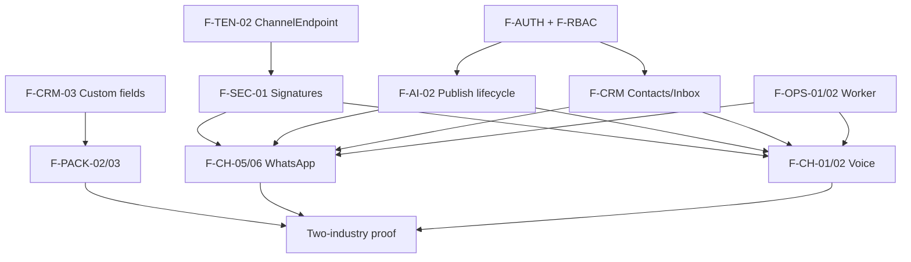

# 02 — Feature Catalog and Scope

## 1. Feature-catalog methodology

Features were identified by tracing:

1. Active SPA routes and screens (`AI/src/App.tsx`, `landingpage.tsx`, page modules) — **UI-VERIFIED**
2. Mounted API route groups (`backend/src/server.ts`, `backend/src/routes/*`) — **CODE-VERIFIED**
3. Prisma models (`backend/prisma/schema.prisma`) — **SCHEMA-VERIFIED**
4. Provider pipelines (`voice.controller.ts`, `webhook.controller.ts`, services) — **CODE-VERIFIED**
5. Product audits (`docs/product-audit/*`) — **AUDIT-VERIFIED**
6. Target platform planning (`airadesk-platform/*`) and confirmed master-prompt direction — **PLANNING-CONFIRMED**
7. Pipeline reference maps (`pipeline-reference/*`) — behavioural extraction evidence

### Separation rules

| Class | Meaning |
| ----- | ------- |
| Current demo features | Observable in `AI/` + `backend/` |
| Production-core features | Required generic platform capabilities |
| Industry-pack features | Delivered as pack templates |
| Tenant-configurable features | Per-company settings/brain |
| Deferred features | Out of confirmed V1 unless PO revises |
| Rejected features | Explicitly out of product direction |

**Authority:** current source code for current state; approved planning + confirmed prompt for target. Conflicts recorded in `04_EVIDENCE_CONFLICTS_AND_DECISIONS.md`.

---

## 2. Complete feature catalog

| Feature ID | Domain | Feature | User | Current state | Target scope | V1 status | Configuration level | Dependencies | Evidence |
| ---------- | ------ | ------- | ---- | ------------- | ------------ | --------- | ------------------- | ------------ | -------- |
| F-AUTH-01 | Auth | Register company + owner | Public | Implemented | Core platform | P0 | Platform | None | **CODE-VERIFIED** `auth.controller.ts` |
| F-AUTH-02 | Auth | Login | User | Implemented | Core platform | P0 | Platform | F-AUTH-01 | **CODE-VERIFIED** |
| F-AUTH-03 | Auth | Session restore `/me` | User | Implemented | Core platform | P0 | Platform | F-AUTH-02 | **CODE-VERIFIED** |
| F-AUTH-04 | Auth | Logout UI | User | UI only (fn exists, no shell button) | Core platform | P0 | Platform | F-AUTH-02 | **AUDIT-VERIFIED** |
| F-AUTH-05 | Auth | Password reset self-service | User | Missing | Core platform | Decision required | Platform + email | Email provider | **AUDIT-VERIFIED** |
| F-AUTH-06 | Auth | Email verification | User | Missing | Core platform | Decision required | Platform | Email | **AUDIT-VERIFIED** |
| F-AUTH-07 | Auth | Session revocation / expiry | User | Missing (demo JWT no revocation) | Core platform | P0 | Platform | ADR-002 | **AUDIT-VERIFIED** gap; target opaque sessions |
| F-RBAC-01 | Authz | OWNER/ADMIN/STAFF roles | Team | Partially implemented | Core platform | P0 | Platform | ADR-004 | **SCHEMA-VERIFIED** / partial BE; matrix **RESOLVED** |
| F-RBAC-02 | Authz | Typed permissions enforcement | Team | Partially implemented (JSON stored) | Core platform | P1 | Tenant + platform | F-RBAC-01 | **CODE-VERIFIED** unenforced |
| F-TEN-01 | Tenancy | companyId scoping on JWT APIs | All | Implemented (typical handlers; **demo JWT current-state**) | Core platform | P0 | Platform | Auth | **CODE-VERIFIED**; production uses opaque sessions |
| F-TEN-02 | Tenancy | ChannelEndpoint registry | Ops | Missing | Core platform | P0 | Tenant | Schema | **Missing**; **PLANNING-CONFIRMED** |
| F-TEN-03 | Tenancy | Fail-closed unknown endpoints | System | Broken (oldest/first fallbacks) | Core platform | P0 | Platform | F-TEN-02 | **CODE-VERIFIED** Unsafe |
| F-CH-01 | Channels | Twilio inbound voice realtime | Caller | Partially implemented | Reusable capability | P0 | Tenant endpoints | F-TEN-02, signatures | **CODE-VERIFIED**; live **Unverified** |
| F-CH-02 | Channels | Twilio outbound AI call | Staff/AI | Partially implemented | Reusable capability | P0 | Tenant | F-CH-01, worker | **CODE-VERIFIED** |
| F-CH-03 | Channels | Twilio signature validation | System | Missing | Core platform | P0 | Platform | Secrets | **CODE-VERIFIED** Missing |
| F-CH-04 | Channels | Call status / recording callbacks | System | Partially implemented | Reusable capability | P0 | Platform | F-CH-03 | **CODE-VERIFIED** handlers |
| F-CH-13 | Channels | Bidirectional idempotent call finalization | System | Implemented in demo | Core platform | P0 | Platform | F-CH-01/02/04 | **CODE-VERIFIED** demo `finalizeCall`; production VOICE-014 |
| F-CH-05 | Channels | Meta WhatsApp inbound | Customer | Partially implemented | Reusable capability | P0 | Tenant endpoints | F-TEN-02, HMAC | **CODE-VERIFIED** |
| F-CH-06 | Channels | Meta WhatsApp outbound | Staff/AI | Partially implemented (mock default) | Reusable capability | P0 | Tenant | Cloud creds | **CODE-VERIFIED** mock SKIPPED |
| F-CH-07 | Channels | WA delivery status callbacks | System | Partially implemented | Reusable capability | P0 | Platform | F-CH-05 | **CODE-VERIFIED** |
| F-CH-08 | Channels | Meta HMAC signature verify | System | Missing | Core platform | P0 | Platform | App secret | **CODE-VERIFIED** Missing |
| F-CH-09 | Channels | Website chat | Customer | Missing ingress (schema enum) | Deferred | Deferred | — | DEC-005 | **SCHEMA-VERIFIED** enum only |
| F-CH-10 | Channels | Email channel | Customer | Missing | Deferred | Deferred | — | DEC-006 | EMAIL_* unused |
| F-CH-11 | Channels | SMS as primary channel | Customer | Missing | Deferred | Deferred | — | — | Not in confirmed V1 |
| F-CH-12 | Channels | Channel endpoint management UI | Admin | Partially implemented (settings numbers) | Core platform | P0 | Tenant | F-TEN-02 | **UI-VERIFIED** settings |
| F-CRM-01 | CRM | Contacts (Customers) | Staff | Implemented | Core platform | P0 | Tenant fields | Auth | **CODE-VERIFIED** |
| F-CRM-10 | CRM | Latest-call intent/requirement projection | Staff | Implemented in demo | Core platform | P1 | Tenant | F-AI-09 | Latest completed analyzed call only; no fabricated aggregate |
| F-CRM-02 | CRM | Opportunities / leads pipeline | Staff | Partially implemented (dual stage models) | Core platform | P1 | Pack + tenant | DEC-012 | **CONFLICT** stages |
| F-CRM-03 | CRM | Custom field definitions | Admin | Missing registry (ungoverned JSON) | Core platform | P0 | Pack + tenant | Domain | **PLANNING-CONFIRMED** gap |
| F-CRM-04 | CRM | Notes / activities | Staff | Partially implemented (notes fields) | Reusable capability | P1 | Tenant | CRM-01 | **PARTIALLY-VERIFIED** |
| F-CRM-05 | CRM | Search / filters | Staff | UI only (header); list filters partial | Core platform | P2 | Platform | APIs | **UI-VERIFIED** header dead |
| F-CRM-06 | CRM | CSV import | Staff | UI only (disabled) | Deferred | Deferred | Tenant | — | **UI-VERIFIED** |
| F-CRM-07 | CRM | Duplicate detection | Staff | Missing | Deferred | Deferred | — | — | **UNKNOWN** need |
| F-CRM-08 | CRM | Tags | Staff | Missing | Deferred | Deferred | — | — | Missing |
| F-CRM-09 | CRM | Data retention / deletion policy | Admin | Partial hard deletes | Core platform | P1 | Tenant policy | Legal DEC | **PARTIALLY-VERIFIED** |
| F-INB-01 | Inbox | Unified inbox | Staff | Implemented | Core platform | P0 | Tenant | Conversations | **CODE-VERIFIED** / **UI-VERIFIED** |
| F-INB-02 | Inbox | Message timeline | Staff | Implemented | Core platform | P0 | — | F-INB-01 | **CODE-VERIFIED** |
| F-INB-03 | Inbox | Call timeline + transcript | Staff | Implemented | Core platform | P0 | — | F-CH-01 | **CODE-VERIFIED** |
| F-INB-11 | Inbox | Call/lead post-call intent + requirements UI | Staff | Implemented in demo | Core platform | P0 | — | F-AI-09…11 | Active inbox + leads only |
| F-INB-04 | Inbox | Recording playback | Staff | Partially implemented | Reusable capability | P1 | Policy | Authz media | **PARTIALLY-VERIFIED** |
| F-INB-05 | Inbox | Human reply (WhatsApp) | Staff | Partially implemented | Core platform | P0 | Channel mode | F-CH-06 | **CODE-VERIFIED** |
| F-INB-06 | Inbox | TAKE_OVER / RETURN_TO_AI | Staff | Implemented | Core platform | P0 | — | F-INB-01 | **CODE-VERIFIED** |
| F-INB-07 | Inbox | Assignment | Staff | Partially implemented | Reusable capability | P1 | Tenant | Team | **PARTIALLY-VERIFIED** |
| F-INB-08 | Inbox | Internal notes | Staff | Partially implemented (handover notes) | Reusable capability | P1 | — | Handoff | **PARTIALLY-VERIFIED** |
| F-INB-09 | Inbox | Realtime browser updates | Staff | Missing | Reusable capability | P2 | Platform | WS/push | **AUDIT-VERIFIED** Missing |
| F-INB-10 | Inbox | SLA tracking | Staff | Missing | Deferred | Deferred | Pack | — | Missing |
| F-TASK-01 | Tasks | Task CRUD + board | Staff | Implemented | Core platform | P0 | Tenant | Auth | **CODE-VERIFIED** |
| F-TASK-02 | Tasks | AI-generated tasks | AI/Staff | Implemented | Reusable capability | P0 | Tools policy | Agent tools | **CODE-VERIFIED** |
| F-TASK-03 | Tasks | Schedule AI outbound call | Staff | Partially implemented | Reusable capability | P0 | Voice | F-CH-02, worker | **CODE-VERIFIED** |
| F-APT-01 | Appointments | Create/list appointment requests | Staff/AI | Implemented as Booking | Core platform | P0 | Pack rules | CRM | **SCHEMA-VERIFIED** Booking; V1 = preference capture → requested (**ADR-005**) |
| F-APT-02 | Appointments | Resource calendars / availability | Admin | Missing | Deferred / Decision required | Deferred | Tenant | Calendar integration later | Missing; not V1 unless calendar exists |
| F-APT-03 | Appointments | Confirm / reschedule / cancel | Staff | Partially implemented (status string) | Core platform | P1 | Tenant | F-APT-01 | **PARTIALLY-VERIFIED** |
| F-APT-04 | Appointments | Reminders | System | Missing dedicated | Reusable capability | P1 | Pack | Outbound | **PROPOSED** |
| F-KNOW-01 | Knowledge | Manual knowledge CRUD | Admin | Implemented | Core platform | P0 | Tenant | Settings | **CODE-VERIFIED** |
| F-KNOW-02 | Knowledge | Documents / URL ingest | Admin | Partially implemented (fields) | Reusable capability | P2 | Tenant | Storage | **PARTIALLY-VERIFIED** |
| F-KNOW-03 | Knowledge | Versioned knowledge bind to deployment | Admin | Missing | Core platform | P1 | Deploy lifecycle | Agent publish | **PLANNING-CONFIRMED** |
| F-KNOW-04 | Knowledge | Citations in answers | AI | Missing | Reusable capability | P2 | — | Retrieval | Missing |
| F-AI-01 | AI | Agent profile / instructions | Admin | Partially implemented (`AiAgent`) | Core platform | P0 | Tenant | Auth | **SCHEMA-VERIFIED** |
| F-AI-02 | AI | Agent draft / test / publish | Admin | Missing | Core platform | P0 | Tenant | F-AI-01 | **PLANNING-CONFIRMED** gap |
| F-AI-03 | AI | Immutable deployment + rollback | Admin | Missing | Core platform | P0 | Tenant | F-AI-02 | **PLANNING-CONFIRMED** |
| F-AI-04 | AI | WhatsApp LLM decision + rule fallback | System | Partially implemented | Reusable capability | P0 | Tenant mode default **DRAFT_ONLY** | F-CH-05, ADR-004 | **CODE-VERIFIED**; production default draft-only |
| F-AI-05 | AI | Controlled tool execution | System | Partially implemented | Core platform | P0 | Deployment allowlist | Domain | **CODE-VERIFIED** actions; needs hardening |
| F-AI-06 | AI | Prompt-injection defence | System | Partially implemented | Core platform | P1 | Platform | Safety | **AUDIT-VERIFIED** gap |
| F-AI-07 | AI | Cost / rate controls | Ops | Missing | Platform operations | P1 | Platform | Observability | Missing |
| F-AI-08 | AI | Ask AI CEO | Owner | Implemented | Reusable capability | P1 | Tenant | OpenAI | **CODE-VERIFIED**; history not persisted |
| F-AI-09 | AI | Post-call transcript intelligence | System | Implemented in demo | Core platform | P0 | Platform | F-CH-13, worker | Demo only; production AI-POSTCALL-001 |
| F-AI-10 | AI | Customer purchase-intent classification | System | Implemented in demo | Core platform | P0 | Platform | F-AI-09 | Transcript-grounded; UNKNOWN required; no accent/emotion |
| F-AI-11 | AI | Customer requirement extraction | System | Implemented in demo | Core platform | P0 | Platform | F-AI-09 | Null/empty for missing fields; no invention |
| F-WF-01 | Workflow | Deterministic workflow engine | System | Missing (rules tables only) | Core platform | P1 | Pack + tenant | Domain | **PLANNING-CONFIRMED** |
| F-WF-02 | Workflow | HandoffRule enforcement | System | Partially implemented / unverified depth | Core platform | P1 | Tenant | F-AI-05 | **PARTIALLY-VERIFIED** |
| F-WF-03 | Workflow | NotificationRule delivery | System | Backend only / unverified runtime | Reusable capability | P1 | Channels | DEC notify | **PARTIALLY-VERIFIED** |
| F-PACK-01 | Packs | Industry pack install | Operator/Admin | Missing | Industry pack | P1 | Platform catalog | Domain | **PLANNING-CONFIRMED** |
| F-PACK-02 | Packs | Real-estate pack | Admin | Missing | Industry pack | P0 (proof) | Pack | F-PACK-01 | **PLANNING-CONFIRMED** |
| F-PACK-03 | Packs | Appointment-service pack | Admin | Missing | Industry pack | P0 (proof) | Pack | F-PACK-01 | **PLANNING-CONFIRMED** |
| F-PACK-04 | Packs | Dermatology admin pack | Admin | Missing | Industry pack | Deferred | Pack | Privacy DECs | Extension |
| F-DASH-01 | Reports | Operational dashboard | Owner | Implemented (read) | Core platform | P0 | Tenant | Aggregates | **CODE-VERIFIED** |
| F-DASH-02 | Reports | Reports overview | Owner | Implemented (revenue disconnected) | Core platform | P1 | Tenant | Aggregates | **CODE-VERIFIED** |
| F-DASH-03 | Reports | Export PDF / schedule report | Owner | UI only | Deferred | Deferred | — | — | **UI-VERIFIED** |
| F-DASH-04 | Reports | Revenue / billing metrics | Owner | Mocked / disconnected | Rejected until billing | Deferred | — | DEC-004 | Honest stub |
| F-SET-01 | Settings | Control room sections | Admin | Implemented | Core platform | P0 | Tenant | RBAC | **CODE-VERIFIED** / **UI-VERIFIED** |
| F-SET-02 | Settings | Billing contact / subscriptions | Owner | UI only | Rejected until billing | Deferred | — | DEC-004 | **UI-VERIFIED** |
| F-SET-03 | Settings | Per-company voice branding | Admin | Broken (Kadam env defaults) | Core platform | P0 | Tenant | F-AI-02 | **CODE-VERIFIED** |
| F-TEAM-01 | Team | Invite / edit / deactivate | Admin | Implemented | Core platform | P0 | Tenant | RBAC | **CODE-VERIFIED** |
| F-TEAM-02 | Team | Invite email delivery | Admin | Missing | Core platform | Decision required | Email | DEC email | EMAIL unused |
| F-OPS-01 | Ops | Outbox worker | System | Implemented in-process | Core platform | P0 | Platform | OutboundCommand | **CODE-VERIFIED** |
| F-OPS-05 | Ops | Post-call analysis background worker | System | Implemented in demo | Core platform | P0 | Platform | F-AI-09 | Async only; never on live audio path |
| F-OPS-02 | Ops | Separate worker process | Ops | Missing | Core platform | P1 | Deploy | F-OPS-01 | **PLANNING-CONFIRMED** |
| F-OPS-03 | Ops | Structured logs / correlation IDs | Ops | Missing | Platform operations | P0 | Platform | — | **AUDIT-VERIFIED** |
| F-OPS-04 | Ops | Error tracking / alerts | Ops | Missing | Platform operations | P1 | Platform | Hosting | **AUDIT-VERIFIED** |
| F-SEC-01 | Security | Webhook signatures | System | Missing | Core platform | P0 | Platform | Secrets | **CODE-VERIFIED** |
| F-SEC-02 | Security | Rate limiting | System | Missing | Core platform | P1 | Platform | Edge/API | **AUDIT-VERIFIED** |
| F-SEC-03 | Security | Prod refuse mock WA | System | Missing | Core platform | P0 | Platform | Config | **CODE-VERIFIED** mock default |
| F-UI-01 | UX | Header search / filters / bell | Staff | UI only | Deferred | P2 | — | — | **UI-VERIFIED** |
| F-UI-02 | UX | Nav badge live counts | Staff | UI only (hardcoded 0) | Core platform | P2 | — | APIs | **UI-VERIFIED** |
| F-LEG-01 | Legacy | Standalone pages (calls, pipeline, …) | — | Legacy | Rejected as duplicate UI | Deferred | — | — | Unmounted modules remain |

---

## 3. Platform administration

| Feature | Current | V1 recommendation | Evidence |
| ------- | ------- | ----------------- | -------- |
| Tenant creation | Self-serve register | Keep for demos; pilot may be manual (**Decision required**) | **CODE-VERIFIED** |
| Tenant activation/deactivation | Missing as platform op | **Proposed V1** minimal (flag) or runbook | Missing |
| Tenant health | IntegrationConnection partial | **Proposed V1** | **SCHEMA-VERIFIED** |
| Channel provisioning | Settings fields | **P0** via ChannelEndpoint | Partial |
| Configuration validation | Weak | **P0** boot guards | Missing prod guards |
| Industry-pack installation | Missing | **P1** / proof **P0** packs | Planning |
| Support access | Missing | **Decision required** | Missing |
| Audit review | Partial AuditLog UI path | **P1** | Partial |
| Feature flags | Missing | **P2** | Missing |
| Usage monitoring | Missing | **P2** (needed before billing) | Missing |

---

## 4. Authentication and team management

| Item | Current state | V1 status |
| ---- | ------------- | --------- |
| Registration | Implemented (demo JWT) | P0 (policy TBD); production issues opaque sessions |
| Manual tenant onboarding | Missing | Decision required |
| Login / logout / session restore | Login+restore yes; logout UI missing; demo JWT in localStorage | P0; target httpOnly opaque sessions (**ADR-002**) |
| Password reset | Admin reset only | Decision required |
| Email verification | Missing | Decision required |
| Invitations | DB user create; no email | P0 DB invite; email Decision required |
| Roles | Enum present; enforcement partial | P0 enforce ADR-004 matrix |
| Typed permissions | Stored; not ACL | P1 decide enforce or remove |
| Deactivation | Implemented | P0 verify login blocks inactive + session revoke |
| Ownership transfer | Missing | Deferred (OWNER-only when added) |
| Audit history | Partial settings | P1 expand |
| Database provider | Demo Postgres | Dedicated Supabase PostgreSQL per env (**ADR-003**) |
| Auth provider | Demo JWT | AiraDesk application sessions — **not** Supabase Auth |

---

## 5. Channels

| Channel | V1 status | Notes |
| ------- | --------- | ----- |
| Twilio inbound voice | P0 | Signatures + ChannelEndpoint mandatory |
| Twilio outbound voice | P0 | Via OutboundCommand + worker |
| Meta inbound WhatsApp | P0 | HMAC + fail-closed mapping |
| Meta outbound WhatsApp | P0 | Cloud only in prod |
| Delivery-status callbacks | P0 | |
| Recording / call-status callbacks | P0 | Retention policy Decision required |
| Website chat | Deferred | Not confirmed V1 |
| Email | Deferred | Dead EMAIL_* today |
| SMS | Deferred | Not confirmed |
| Channel endpoint management | P0 | New entity |

---

## 6. CRM

| Item | V1 status |
| ---- | --------- |
| Contacts | P0 |
| Opportunities | P1 (unify stages) |
| Custom fields | P0 |
| Pipelines / stages | P0 foundation / P1 polish |
| Lead scoring | P2 / Decision required (demo has score fields) |
| Ownership | P1 |
| Notes / activities | P1 |
| Search / filtering | P1 list; P2 global header |
| Import/export | Deferred |
| Duplicate detection / tags | Deferred |
| Data retention / deletion | P1 policy |

---

## 7. Conversations and human takeover

| Item | V1 status |
| ---- | --------- |
| Unified inbox | P0 |
| Message / call timelines | P0 |
| Transcripts / recordings | P0 / P1 authz+retention |
| AI/human sender identity | P0 (exists) |
| Human takeover / return-to-AI | P0 |
| Assignment / internal notes | P1 |
| Escalation rules | P1 enforce |
| SLA tracking | Deferred |
| Realtime browser updates | P2 |

---

## 8. Tasks and appointments

| Item | V1 status |
| ---- | --------- |
| Task CRUD / assignment / statuses / due dates | P0 |
| AI-generated tasks | P0 |
| Scheduled AI calls | P0 |
| Appointments create/status | P0 (V1 = request/preference → requested; **ADR-005**) |
| Resource calendars / availability engine | Deferred unless calendar integration approved |
| Confirmation / reschedule / cancel | P1 |
| Reminders | P1 |
| Industry-specific appointment data | Via custom fields P0 |

---

## 9. Knowledge and content

| Item | V1 status |
| ---- | --------- |
| Manual knowledge entry | P0 |
| Documents / URLs | P2 |
| Structured products/services / inventory | Pack + custom fields P1 |
| Knowledge versions / approval / expiry | P1 |
| Tenant isolation | P0 |
| Retrieval | P0 basic |
| Citations | P2 |
| Stale-knowledge behaviour | P1 policy |

---

## 10. AI agent and workflows

| Item | V1 status |
| ---- | --------- |
| Agent profile / drafts / deployments | P0 |
| Instructions / capabilities / tools | P0 |
| Workflows + deterministic rules | P1 engine; P0 minimal handoff |
| AI classification | P0 (port behaviour) |
| Data collection schema | P0 custom fields |
| Action validation | P0 |
| Handoff | P0 |
| Testing / versioning / rollback | P0 |
| Prompt-injection defence | P1 |
| Cost and rate controls | P1 |

---

## 11. Industry packs

| Item | V1 status |
| ---- | --------- |
| Pack creation / versioning / installation | P1 platform; P0 two proof packs |
| Defaults / tenant overrides / upgrade / rollback | P1 |
| Pack test scenarios | P0 for proof packs |
| UI terminology | P0 |
| Pack-specific reports | P1 |
| Compliance extensions (healthcare) | Deferred extension |

---

## 12. Dashboard, reports and AI CEO

| Item | V1 status |
| ---- | --------- |
| Operational dashboard | P0 |
| Inbox / lead / call / task / appointment / team metrics | P0–P1 as data exists |
| AI performance / handoff rate / provider failures | P1 |
| AI CEO | P1 (exists in demo; port carefully) |
| Revenue / billing metrics | **Rejected** until billing source |
| Export / scheduled reports | Deferred |

---

## 13. Settings and configuration

| Area | Belongs to |
| ---- | ---------- |
| Platform secrets, pack catalog, tenant break-glass | Platform operator |
| Company identity, billing contact (later), ownership | Tenant owner |
| Channels, AI drafts/publish, knowledge, stages, rules, team | Tenant admin |
| Inbox/task day-to-day prefs | Staff (limited) |
| Default fields/stages/workflows/safety | Industry pack |
| Immutable live brain | Deployment process (publish) |

---

## 14. Observability and operations

| Item | V1 status |
| ---- | --------- |
| Structured logs, request/correlation IDs, company IDs | P0 |
| Provider event IDs / voice session IDs | P0 |
| Metrics / alerts / error tracking | P0–P1 |
| Audit events | P0 expand |
| Provider / outbox / voice-session health | P1 |
| Cost tracking | P1 |
| Backup / restore / runbooks | P1 |

---

## 15. Security and compliance

| Item | V1 status | Notes |
| ---- | --------- | ----- |
| Tenant isolation | P0 | Fail-closed ingress |
| RBAC | P0 | |
| Provider signatures | P0 | |
| Replay protection | P1 | |
| Rate limiting | P1 | |
| Secret management | P0 | No secrets in git |
| Recording access / consent | P1 | Legal Decision required |
| Data retention / export / deletion | P1 | |
| Sensitive fields | P1 | |
| Healthcare extension | Deferred | No compliance claim |
| Auditability | P0 | |

Do **not** claim HIPAA/GDPR/etc. compliance without formal validation (**UNKNOWN** / legal).

---

## 16. V1 scope

### Confirmed V1

| Item | Reason |
| ---- | ------ |
| Multi-tenant company + users + opaque session auth | Required; demo JWT is current-state only |
| ChannelEndpoint fail-closed routing | Confirmed direction; fixes critical demo hazard |
| Twilio voice inbound/outbound with signatures | Confirmed channel |
| Meta WhatsApp inbound/outbound + status with HMAC | Confirmed channel |
| Contacts, conversations, messages, calls, tasks, appointment requests | Core CRM |
| Human takeover | Core |
| Knowledge CRUD + retrieval scoped by company | Core |
| Agent draft → test → publish → rollback | Confirmed lifecycle |
| Custom fields + two industry packs (RE + appointment) | Genericity proof |
| Outbox worker (separate process target) | Reliability |
| RBAC enforcement foundation (ADR-004) | Security |
| WhatsApp AI default `DRAFT_ONLY` | Safety |
| Structured observability baseline | Operability |
| No production mock WhatsApp success | Honesty/safety |
| Dedicated Supabase PostgreSQL per environment | Data isolation |

### Proposed V1

| Item | Reason |
| ---- | ------ |
| AI CEO port | Valuable; not blocking voice/WA certification |
| NotificationRule real delivery | Settings currently overpromise |
| Recording retention job | Risk reduction |
| Logout + session hardening | Basic UX/security |
| Minimal platform operator runbooks (even without full console) | Pilot ops |

### Deferred

| Item | Reason |
| ---- | ------ |
| Website chat, email, SMS | Not confirmed V1 |
| Billing / revenue metrics | No processor |
| CSV import, header search/notifications, SLA | Non-blocking |
| Full calendar availability engine | Deferred (Appointment V1 = requests only) |
| Dermatology pack | After privacy decisions |
| Ownership transfer, marketplace | Out of scope |

### Rejected

| Item | Reason |
| ---- | ------ |
| Medical diagnosis / clinical advice tools | Safety non-goal |
| Industry code forks | Product principle |
| Fake revenue | Honest stub policy |
| Oldest/default company ingress fallbacks | Explicitly forbidden |
| Wholesale copy of `voice.controller.ts` | Extraction rules |
| Treating unused `voiceProvider.service` as production voice | Stub/unused |

### Product-owner decision required

| Item | Why |
| ---- | --- |
| Pilot onboarding model | Blocks Gate 11 |
| Billing hide vs build | Blocks commercial claims |
| Email provider for invites/reset | Blocks F-AUTH-05/F-TEAM-02 |
| Recording consent/retention | Blocks healthcare and possibly voice pilot legal |
| Website chat / email inclusion | Scope freeze |
| Object-storage provider for recordings | Before VOICE-011 |
| Non-prod DB Option A vs B | During DB-001 |

Resolved (keep for history): RBAC matrix (**ADR-004**), WhatsApp `DRAFT_ONLY` default (**ADR-004**), Appointment V1 request scope (**ADR-005**), opaque sessions (**ADR-002**).

---

## 17. Feature dependencies

| Feature | Depends on |
| ------- | ---------- |
| WhatsApp certified | Tenancy, HMAC, Contacts/Conversations, Agent deployment, Worker, Prod mock ban |
| Voice certified | Tenancy, Twilio signatures, Agent deployment, Call/Recording, Worker for outbound |
| Two-industry proof | Custom fields, packs, agent publish, CRM, both channels (or simulated harness + one live) |
| Pilot release | All P0 security + observability + RBAC + green CI |

---

*End of Feature Catalog and Scope.*
