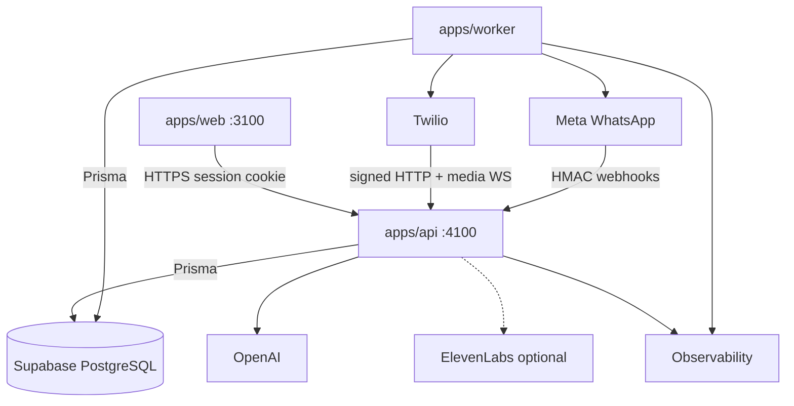
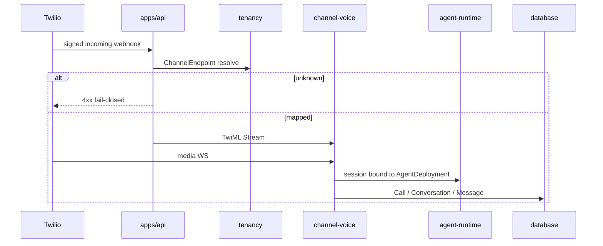
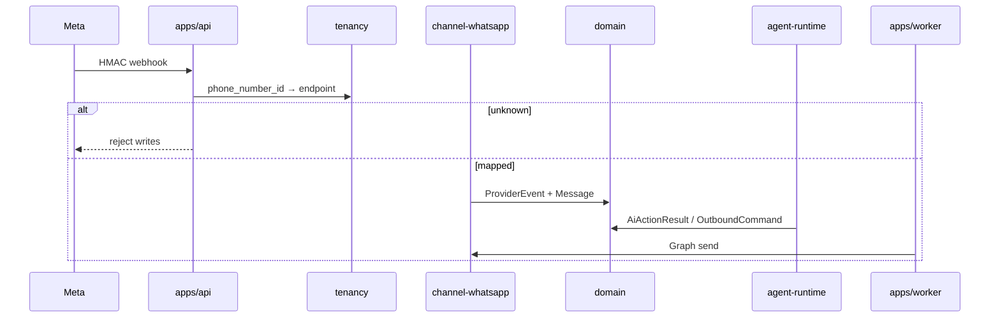
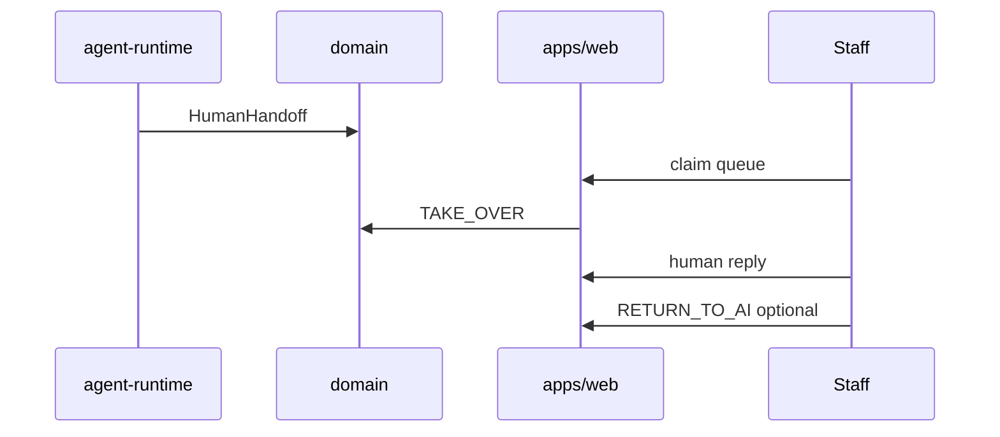
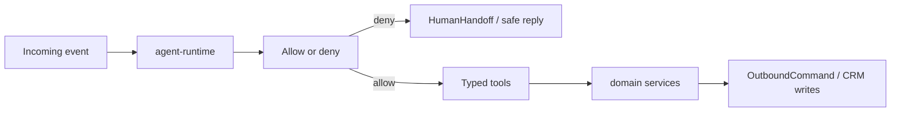
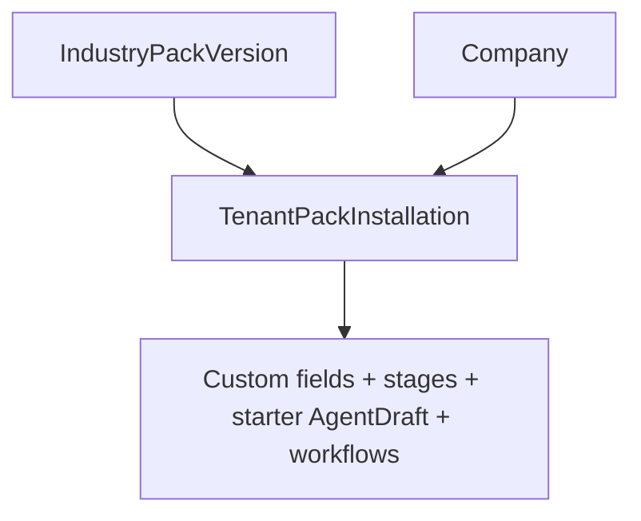
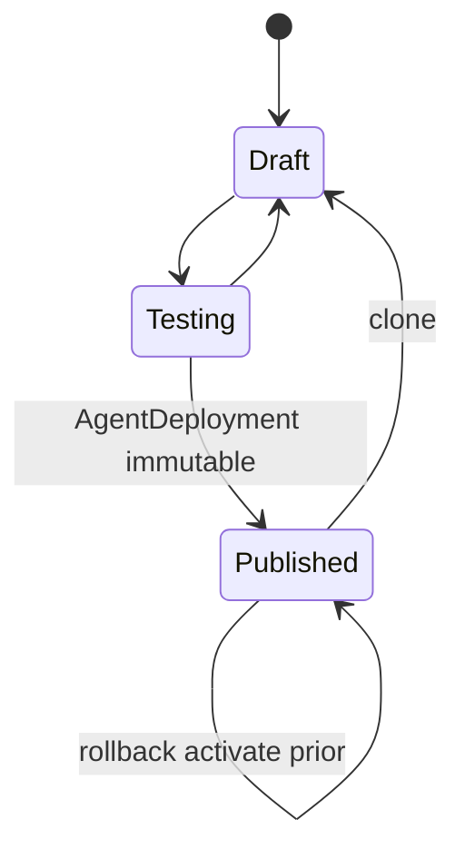

# 03 — Production Implementation Plan

## 1. Planning principles

| Principle                                | Meaning                                                                                                              |
| ---------------------------------------- | -------------------------------------------------------------------------------------------------------------------- |
| Build the generic platform once          | One `airadesk-platform` codebase for all industries                                                                  |
| Configuration rather than code forks     | Industry packs + custom fields + tenant brain                                                                        |
| Secure tenancy before provider traffic   | ChannelEndpoint + signatures before live webhooks                                                                    |
| Green builds before large refactors      | Tooling/CI health first in the **new** workspace                                                                     |
| Port behaviour, not dead code            | Use `pipeline-reference` evidence; do not import `AI/`, `backend/`, or `pipeline-reference` into production packages |
| Contract-first communication pipelines   | Provider-independent contracts from `PIPELINE_CONTRACTS.md`                                                          |
| Tests before live provider certification | Fixtures and negative signature tests first                                                                          |
| No production mock modes                 | Mock WhatsApp must not silently succeed in prod                                                                      |
| No broad rewrite without evidence        | Modular monolith; extract voice process only with metrics                                                            |
| Every task independently reviewable      | One focused Cursor prompt per backlog row                                                                            |

---

## 2. Starting-state assessment

### Reusable demo capabilities (behavioural reference)

| Capability                                                       | Evidence path                                                                 |
| ---------------------------------------------------------------- | ----------------------------------------------------------------------------- |
| JWT register/login/me + company scoping (**demo current-state**) | `backend/src/controllers/auth.controller.ts`, `middleware/auth.middleware.ts` |
| Inbox / leads / tasks / team / settings / reports / AI CEO       | `AI/src/*.tsx` + matching controllers                                         |
| Twilio Media Streams ↔ OpenAI Realtime (± ElevenLabs)            | `voice.controller.ts` (~4869 lines), `backend/src/voice/*`, `server.ts` WS    |
| Meta WhatsApp Cloud send/receive behind mock/cloud switch        | `webhook.controller.ts`, `whatsappProvider.service.ts`                        |
| Outbox interval worker                                           | `outboxWorker.service.ts`                                                     |
| Prisma multi-tenant schema                                       | `backend/prisma/schema.prisma`                                                |

### Unsafe demo assumptions

| Assumption                                                                      | Evidence                                                              |
| ------------------------------------------------------------------------------- | --------------------------------------------------------------------- |
| Voice company = `VOICE_COMPANY_ID` or oldest company                            | `getVoiceCompany` in `voice.controller.ts` **CODE-VERIFIED**          |
| WhatsApp company = phone id OR `WHATSAPP_DEFAULT_COMPANY_ID` OR oldest settings | `getCompanyForMetaWhatsApp` **CODE-VERIFIED**                         |
| Unsigned Meta/Twilio webhooks acceptable                                        | No signature validators found **CODE-VERIFIED**                       |
| WhatsApp mock mode OK by default                                                | `whatsappProviderMode` default `mock`; SKIPPED send **CODE-VERIFIED** |
| Hardcoded “Kadam Web Design” voice persona fallback                             | `VOICE_BUSINESS_NAME` defaults **CODE-VERIFIED**                      |
| Verify token fallback `airadesk_verify_token`                                   | `webhook.controller.ts` / integration controller **CODE-VERIFIED**    |

### Dead or legacy code

| Item                          | Path                                                                                                                                                                 |
| ----------------------------- | -------------------------------------------------------------------------------------------------------------------------------------------------------------------- |
| Unused CRM voice stub         | `backend/src/services/voiceProvider.service.ts`                                                                                                                      |
| Unmounted FE modules          | `AI/src/calls.tsx`, `whatsapp.tsx`, `pipeline.tsx`, `handover.tsx`, `bookings.tsx`, `agents.tsx`, `analytics.tsx`, `integrations.tsx`, `knowledge.tsx`, `outbox.tsx` |
| EMAIL_* env without src usage | backend env leftovers **AUDIT-VERIFIED**                                                                                                                             |
| Hollow `backend/package.json` | scripts-only manifest **CODE-VERIFIED**                                                                                                                              |

### Missing production modules

ChannelEndpoint, ProviderEvent, AgentDraft/Deployment, IndustryPack*, WorkflowVersion, enforced RBAC middleware, signature verification, observability stack, CI/CD, separate worker app — **AUDIT-VERIFIED** / **PLANNING-CONFIRMED**.

### New-platform folder state

`airadesk-platform/` contains an installable pnpm workspace (`apps/web`, `apps/api`, `apps/worker`), `@airadesk/config` environment contracts (**PLATFORM-002 / CONFIG-001 — Complete**), `@airadesk/domain` primitives (**DOMAIN-001 — Complete**) and Company/User/Role/Session contracts (**DOMAIN-002 — Complete**; Company tenant root; User/Session tenant-scoped; session contracts contain no credentials; roles defined, authorization unimplemented; no DB/provider dependency in domain), and `@airadesk/database` Prisma/Supabase connection architecture (**DB-001A — Complete**; no app models/migrations; live verify **DB-001B — Pending**). Authentication flows and CRM entities beyond Company/User/Session contracts are not implemented yet. **Next task:** `DB-001B`.

### Pipeline-reference folder state

Documentation complete for maps/contracts/extraction; `contracts/`, `fixtures/`, `tests/`, and channel subfolders largely `.gitkeep` only (**CODE-VERIFIED**).

---

## 3. Target architecture

Modular monolith deployables (**PLANNING-CONFIRMED** `ARCHITECTURE.md`, **ADR-001/003**):

```text
Web application          → apps/web (port 3100)
API + voice WebSocket    → apps/api (port 4100; voice module; split later only with evidence)
Background worker        → apps/worker (no HTTP port during PLATFORM-001)
Managed database         → Supabase Database (PostgreSQL engine)
ORM / migrations         → Prisma (future; not PLATFORM-001)
                           Dedicated Supabase PostgreSQL project/database per environment
                           (staging ≠ production; demo DB never reused)
Web authentication       → AiraDesk opaque server-side sessions (httpOnly cookies)
                           Database provider ≠ auth provider (not Supabase Auth)
Optional object storage  → recording audio files (provider Unknown before VOICE-011);
                           PostgreSQL stores recording metadata only
Central observability    → packages/observability + external APM
```

Access paths:

```text
Web → API → Prisma → Supabase PostgreSQL
Worker → Prisma → Supabase PostgreSQL
```

No `@supabase/supabase-js` in web; no service-role keys in browser; browser DB access not permitted. Supabase Auth/Storage/Realtime not selected. RLS not primary authz (may be defence in depth later). Non-prod dedicated Supabase project + connection mode: **ADR-009** / **DB-001A** (live verify **DB-001B**). Backup policy before pilot; pgvector not enabled.

### Package boundaries

Follow `airadesk-platform/MODULE_BOUNDARIES.md`: `domain` has no providers; `tenancy` owns fail-closed resolution; `channel-voice` / `channel-whatsapp` are adapters; `agent-runtime` orchestrates published deployments; apps orchestrate packages; **never import demo or pipeline-reference**.

### Runtime



### Voice inbound



### WhatsApp inbound



### Human takeover



### AI action



### Industry-pack installation



### Agent publication



---

## 4. Implementation workstreams

| WS                                   | Objective                    | Facts from repository                   | Target outcome                                                          | Dependencies             | Risks                         | Exit criteria                                 |
| ------------------------------------ | ---------------------------- | --------------------------------------- | ----------------------------------------------------------------------- | ------------------------ | ----------------------------- | --------------------------------------------- |
| WS-01 Repository and workspace       | Isolated monorepo tooling    | Empty scaffold + docs                   | Installable pnpm workspace; ports 3100/4100; Supabase DB isolation docs | None                     | Port collision with demo      | PLATFORM-001 acceptance                       |
| WS-02 Domain model                   | Stable types/contracts       | DOMAIN_MODEL + PIPELINE_CONTRACTS docs  | `packages/domain` schemas (DOMAIN-001…007)                              | WS-01                    | Over-copying demo names       | Types + unit tests                            |
| WS-03 Database and migrations        | Supabase PostgreSQL + Prisma | Demo schema reference only              | Migrations in platform DB package against dedicated Supabase projects   | WS-02                    | Accidental demo DB reuse      | DB-001…008; migrate on empty DB; staging≠prod |
| WS-04 Tenancy and channel endpoints  | Fail-closed routing          | Unsafe getVoiceCompany / Meta fallbacks | ChannelEndpoint resolve API                                             | WS-03                    | Residual fallbacks            | Unknown → zero writes                         |
| WS-05 Auth and authorization         | Opaque sessions + RBAC       | Demo JWT localStorage; partial RBAC     | Session cookies + ADR-004 matrix enforced                               | WS-03, ADR-002/004       | Weak matrix / JWT relapse     | Authz tests green                             |
| WS-06 Agent configuration            | Draft/publish                | AiAgent only                            | AgentDraft/Deployment                                                   | WS-03, WS-05             | Live mutation of drafts       | Lifecycle tests                               |
| WS-07 Workflow and tools             | Controlled actions           | aiAction/llmDecision behaviour          | Tool policy + workflow engine MVP; WA default DRAFT_ONLY                | WS-06                    | Unrestricted writes           | Policy deny tests                             |
| WS-08 Industry packs + custom fields | Genericity                   | Missing packs                           | Pack install + field registry                                           | WS-03                    | Fork temptation               | Two packs load                                |
| WS-09 Voice channel                  | Twilio path                  | Large voice.controller                  | channel-voice adapters (VOICE-001…013)                                  | WS-04, WS-06, signatures | Scope creep copying 4.8k LOC  | Contract + signed tests                       |
| WS-10 WhatsApp channel               | Meta path                    | webhook + provider                      | channel-whatsapp; DRAFT_ONLY default                                    | WS-04, WS-06             | Mock leakage                  | HMAC + cloud tests                            |
| WS-11 CRM and inbox                  | Core ops UI/API              | Demo inbox/CRM                          | Contacts/conversations/handoff (CRM-001…008)                            | WS-05, WS-03             | Dual stage models             | API + tenant tests                            |
| WS-12 Tasks and appointments         | Ops scheduling               | Task/Booking models                     | Task + Appointment **request** APIs/tools (ADR-005)                     | WS-11, WS-07             | Calendar overbuild            | CRUD + tool tests                             |
| WS-13 Web application                | Operator UI                  | Demo IA as UX evidence                  | apps/web on 3100                                                        | WS-05+                   | Pixel-clone pressure          | Smoke e2e                                     |
| WS-14 Background worker              | Outbox/schedules             | In-process worker                       | apps/worker leasing                                                     | WS-03, channels          | Double-send                   | Concurrency tests                             |
| WS-15 Testing and quality            | CI quality                   | No demo tests                           | Unit/contract/integration/e2e                                           | WS-01                    | Flaky live deps               | Required CI gates                             |
| WS-16 Security                       | Harden ingress/authz         | Critical blockers in audit              | Signatures, rate limits, secrets hygiene                                | WS-04, WS-05             | False “secured” without tests | Negative tests                                |
| WS-17 Observability                  | Operate staging              | console only                            | Structured logs + errors + metrics                                      | WS-01                    | PII in logs                   | Correlation IDs present                       |
| WS-18 Deployment and ops             | Staging/pilot                | No Docker/CI                            | Compose/CI/runbooks; separate Supabase projects; backup runbook         | Many                     | Premature prod                | Staging checklist signed                      |

---

## 5. Implementation gates

### Gate 0 — Product definition approved

- **Entrance:** Blueprint docs exist (this set).
- **Exit:** DEC-003…DEC-006 resolved or explicitly deferred with owners; DEC-001/002/008/009 resolved via ADR-004/005/002; V1 channel scope frozen to voice+WhatsApp.

### Gate 1 — New workspace reproducible

- **Entrance:** Gate 0.
- **Exit:** `airadesk-platform` installs; lint/typecheck scripts exist; ports 3100/4100; dedicated Supabase DB isolation documented; no demo imports.

### Gate 2 — Domain and tenancy foundation

- **Entrance:** Gate 1.
- **Exit:** Migrations apply; ChannelEndpoint resolve fail-closed; two-tenant harness exists.

### Gate 3 — Authentication and authorization

- **Entrance:** Gate 2 (DEC-001/009 resolved via ADR-004/002).
- **Exit:** Register/login/me with opaque sessions; RBAC matrix tests green; deactivated users blocked; sessions revocable.

### Gate 4 — Agent configuration foundation

- **Entrance:** Gate 3 (DEC-002 resolved via ADR-004 — WhatsApp `DRAFT_ONLY` default).
- **Exit:** Draft→test→publish→rollback APIs; live bind uses deployment id only.

### Gate 5 — CRM foundation

- **Entrance:** Gate 3.
- **Exit:** Contacts, conversations, messages, tasks, appointments CRUD with company scope + custom field validation.

### Gate 6 — Provider contracts and fixtures

- **Entrance:** Gate 2.
- **Exit:** Sanitized Twilio/Meta fixtures + contract tests; signature negative cases.

### Gate 7 — WhatsApp certified

- **Entrance:** Gates 4–6, WS-10, worker send path.
- **Exit:** Staging sandbox: signed inbound → correct tenant → reply deliverable; unknown endpoint writes zero rows; mock banned in prod config.

### Gate 8 — Voice certified

- **Entrance:** Gates 4–6, WS-09.
- **Exit:** Staging: signed inbound call → deployment-bound session → CRM writeback; outbound AI call leased once; recording callback authz path defined.

### Gate 9 — Two-industry proof

- **Entrance:** Gates 7–8 (or harness-equivalent with one live channel minimum — **Decision required** if both cannot be live).
- **Exit:** Same code; real-estate + appointment packs differ fields/workflows/tools/reports; no cross-tenant data; no industry forks.

### Gate 10 — Operable staging

- **Entrance:** Observability + deploy runbooks.
- **Exit:** Alerts, error tracking, backup restore drill documented; CI green.

### Gate 11 — Pilot release

- **Entrance:** Gates 0–10; legal recording/privacy minimums decided.
- **Exit:** Closed pilot checklist signed; known limitations documented; rollback conditions clear.

---

## 6. Detailed implementation backlog

Complexity includes reasoning. No hour/day estimates.

Task IDs below align with `airadesk-platform/IMPLEMENTATION_BACKLOG.md`. Legacy oversized items map as: T-004 → DOMAIN-001…007; T-006 → DB-001…009; T-010–T-012 → AUTH-001…007; T-027 → CRM-001…005/008; T-030 → CRM-006…007; T-024–T-026 → VOICE-001…013.

| Task ID        | Workstream | Task                                                                 | Why required                  | Evidence                                     | Priority | Complexity               | Dependencies                       | Expected files/modules                                  | Acceptance criteria                                                                                                                     | Required tests          | Rollback                         |
| -------------- | ---------- | -------------------------------------------------------------------- | ----------------------------- | -------------------------------------------- | -------- | ------------------------ | ---------------------------------- | ------------------------------------------------------- | --------------------------------------------------------------------------------------------------------------------------------------- | ----------------------- | -------------------------------- |
| T-001          | WS-01      | Initialize workspace tooling (pnpm, apps scaffolds, scripts)         | Unblocks all work             | Empty `.gitkeep` apps; PLATFORM-001; ADR-001 | P0       | M                        | None                               | `airadesk-platform/package.json`, `apps/*/`, `tooling/` | Install works; health on **4100**; web **3100**; no demo imports                                                                        | Smoke install           | Revert scaffold commit           |
| T-002          | WS-01      | Add `.env.example` names-only + gitignore secrets                    | Secret hygiene                | Tracked `AI/.env` risk in demo               | P0       | XS                       | T-001                              | `.env.example`, `.gitignore`                            | No `.env` committed                                                                                                                     | CI deny `.env`          | Revert                           |
| T-003          | WS-01      | `packages/config` env schema fail-fast                               | Prod boot safety              | Audit BLOCKER-008                            | P0       | S                        | T-001                              | `packages/config`                                       | Missing prod keys throw                                                                                                                 | Unit accept/reject      | Feature flag bypass staging only |
| DOMAIN-001…007 | WS-02      | Domain contracts (primitives → ProviderEvent)                        | Shared vocabulary             | DOMAIN_MODEL.md                              | P0       | L — split entities       | T-001                              | `packages/domain`                                       | Types for Company…ProviderEvent + Session                                                                                               | Unit schema tests       | Version bump                     |
| T-005          | WS-02      | Implement communication contracts (Incoming/Outgoing/AiAction)       | Contract-first channels       | PIPELINE_CONTRACTS.md                        | P0       | M                        | DOMAIN-001…007                     | `packages/domain/contracts`                             | Matches documented fields                                                                                                               | Contract tests          | —                                |
| DB-001A        | WS-03      | Prisma package + Supabase connection architecture                    | Persistence foundation        | ADR-003, ADR-009                             | P0       | M                        | DOMAIN-001                         | `packages/database`                                     | Offline Prisma package; runtime/direct URL contracts; private `airadesk` schema intent; no browser creds; no app models                                                                                | Offline unit + generate | —                                |
| DB-001B        | WS-03      | Connect and verify non-production Supabase                           | Persistence foundation        | ADR-009                                      | P0       | S                        | DB-001A                            | secrets + `db:connection:check`                         | Live `SELECT 1`; no schema mutation; demo DB unused                                                                                                                                                     | Connection smoke        | —                                |
| DB-002…008     | WS-03      | Entity migrations on Supabase                                        | Persistence                   | Demo schema inspiration only                 | P0       | L                        | DB-001B + matching DOMAIN          | `packages/database`                                     | Tables for auth/CRM/channels/agent/outbox in `airadesk`                                                                                                                                                 | Migration CI            | `migrate resolve` discipline     |
| DB-009         | WS-18      | Supabase backup/restore/env runbook                                  | Pilot ops                     | ADR-003                                      | P1       | M                        | DB-001A                            | `docs/runbooks`                                         | Staging≠prod; restore drill                                                                                                             | Manual                  | —                                |
| T-007          | WS-04      | ChannelEndpoint model + unique provider keys                         | Tenancy integrity             | Missing entity; unsafe fallbacks             | P0       | M                        | DB-003                             | schema + `packages/tenancy`                             | Unique endpoint→company                                                                                                                 | Integration uniqueness  | —                                |
| T-008          | WS-04      | Resolve API fail-closed (no oldest company)                          | Critical security             | `getVoiceCompany`, Meta fallbacks            | P0       | S                        | T-007                              | `packages/tenancy`                                      | Unknown → error + 0 writes                                                                                                              | Integration             | —                                |
| T-009          | WS-04      | Two-tenant isolation harness                                         | Prevent regressions           | Audit requirement                            | P0       | M                        | T-008, AUTH-001                    | `tests/integration`                                     | Shared harness                                                                                                                          | Harness green           | —                                |
| AUTH-001       | WS-05      | Secure session authentication foundation                             | Access control                | Demo JWT current-state; ADR-002              | P0       | M                        | DB-002                             | `packages/auth`, `apps/api`                             | Opaque token → httpOnly cookie → hashed session in Supabase PG                                                                          | API session tests       | —                                |
| AUTH-002…004   | WS-05      | Role policy, API middleware, ownership helpers                       | Close privilege gap           | ADR-004; partial demo RBAC                   | P0       | L                        | AUTH-001                           | `packages/auth`                                         | Matrix enforced; OWNER-only ownership helpers                                                                                           | Authz matrix            | —                                |
| AUTH-005…007   | WS-05      | Role-aware nav, revocation, matrix integration tests                 | Session + UX safety           | Logout UI missing in demo                    | P0/P1    | M                        | AUTH-001…003                       | web + auth + tests                                      | Logout/revoke; inactive denied; matrix green                                                                                            | API + e2e + integration | —                                |
| T-013          | WS-06      | AgentProfile + AgentDraft CRUD                                       | Brain foundation              | AiAgent gap                                  | P0       | M                        | AUTH-003, DB-007                   | `agent-runtime` + API                                   | Draft not live                                                                                                                          | API tests               | —                                |
| T-014          | WS-06      | Publish immutable AgentDeployment + rollback                         | Lifecycle                     | PLANNING-CONFIRMED                           | P0       | M                        | T-013                              | `agent-runtime`                                         | Prior version reactivatable                                                                                                             | Lifecycle unit          | Reactivate prior                 |
| T-015          | WS-06      | Bind ChannelEndpoint to deployment id                                | Prevent silent mid-call edits | Prompt direction                             | P0       | S                        | T-014, T-007                       | tenancy + agent                                         | Live uses deployment only                                                                                                               | Integration             | —                                |
| T-016          | WS-08      | CustomFieldDefinition validation service                             | Industry genericity           | Ungoverned JSON in demo                      | P0       | M                        | DOMAIN-003                         | `packages/domain`                                       | Reject undefined keys                                                                                                                   | Unit matrix             | —                                |
| T-017          | WS-08      | Industry pack format + load real_estate + appointment_services stubs | Proof packs                   | PLANNING-CONFIRMED                           | P0       | M                        | T-016                              | `packages/industry-packs`                               | Packs load versioned                                                                                                                    | Unit load               | —                                |
| T-018          | WS-08      | TenantPackInstallation apply defaults                                | Install path                  | DOMAIN_MODEL                                 | P1       | L                        | T-017, T-013                       | industry-packs + API                                    | Creates fields/stages/draft                                                                                                             | Integration             | Uninstall flagged                |
| T-019          | WS-16      | Meta HMAC verification middleware                                    | BLOCKER-001                   | Missing signatures                           | P0       | M                        | T-003                              | `channel-whatsapp`                                      | Invalid → 401/403                                                                                                                       | Contract negatives      | —                                |
| T-020          | WS-16      | Twilio signature validation on voice HTTP                            | BLOCKER-002                   | Missing signatures                           | P0       | M                        | T-003                              | `channel-voice`                                         | Invalid rejected                                                                                                                        | Contract negatives      | —                                |
| T-021          | WS-10      | WhatsApp verify challenge + inbound → ProviderEvent/Message          | Channel ingress               | webhook.controller behaviour                 | P0       | L                        | T-008, T-019, T-005, DB-008        | `channel-whatsapp`                                      | Idempotent ingest                                                                                                                       | Integration             | —                                |
| T-022          | WS-10      | Outbound Graph send + status webhooks                                | Delivery                      | whatsappProvider; ADR-004 DRAFT_ONLY         | P0       | M                        | T-021, T-028                       | channel-whatsapp + worker                               | Delivery updates; AI default draft-only                                                                                                 | Integration             | —                                |
| T-023          | WS-10      | Prod fail-closed when mock mode                                      | BLOCKER-008                   | mock SKIPPED default                         | P0       | S                        | T-003                              | config + whatsapp                                       | Prod boot/refuse mock success                                                                                                           | Unit guards             | Staging allow flag               |
| VOICE-001…005  | WS-09      | Signature, tenant resolve, TwiML, Media Stream, audio transport      | Voice path                    | voice routes + playback                      | P0       | XL — realtime complexity | T-008, T-020                       | `channel-voice`                                         | TwiML/WS contracts; no CRM in transport                                                                                                 | Contract + unit         | —                                |
| VOICE-006…010  | WS-09      | Realtime adapter, deployment session, transcript, tools, status      | Voice brain + CRM             | voice.controller realtime                    | P0       | XL                       | VOICE-005, T-015, CRM-003          | agent-runtime + channel-voice                           | Uses deployment snapshot                                                                                                                | Integration harness     | —                                |
| VOICE-011      | WS-09      | Recording callback and access flow                                   | Media policy                  | Call recording fields                        | P1       | M                        | VOICE-010; object-storage decision | channel-voice + storage                                 | Metadata in PG; files in object storage                                                                                                 | Integration             | —                                |
| VOICE-012      | WS-09      | Outbound call placement                                              | Scheduled/outbound            | aiScheduledCall.service                      | P0       | L                        | VOICE-003, T-028                   | channel-voice + worker                                  | Single dial under lease                                                                                                                 | Lease tests             | Cancel command                   |
| VOICE-013      | WS-15      | Voice latency and regression harness                                 | Quality                       | EXTRACTION_PLAN                              | P1       | M                        | VOICE-007                          | `tests/`                                                | Mocked CI harness                                                                                                                       | Harness suite           | —                                |
| VOICE-014      | WS-09      | Idempotent bidirectional call finalization                           | Call lifecycle                | Demo `finalizeCall` service                  | P0       | M                        | VOICE-010                          | channel-voice + domain                                  | Customer/AI/provider end paths; terminal independent of analysis                                                                        | Unit + integration      | —                                |
| DOMAIN-008     | WS-02      | Post-call analysis contracts                                         | Shared vocabulary             | Demo CallPostAnalysis enums                  | P0       | S                        | DOMAIN-001                         | `packages/domain`                                       | Intent/requirement/status contracts; UNKNOWN + insufficient-data                                                                        | Unit schema tests       | —                                |
| DB-010         | WS-03      | Post-call analysis persistence                                       | Persistence                   | Demo CallPostAnalysis model                  | P0       | M                        | DB-001B, DOMAIN-008                | `packages/database`                                     | 1:1 Call analysis; additive migration; company-scoped                                                                                   | Migration CI            | —                                |
| AI-POSTCALL-001| WS-09      | Transcript-grounded intent and requirement analyzer                  | Post-call intelligence        | Demo postCallAnalysis.service                | P0       | L                        | DOMAIN-008, VOICE-014              | agent-runtime                                           | No live-path analysis; no accent/emotion; validated structured output                                                                   | Fixture quality suite   | —                                |
| WORKER-POSTCALL-001 | WS-14 | Durable post-call analysis worker                                    | Reliable async jobs           | Demo postCallAnalysisWorker                  | P0       | M                        | DB-010, AI-POSTCALL-001, T-028     | `apps/worker`                                           | Claim/lease; transcript settle; restart-safe; bounded retries                                                                           | Concurrency tests       | —                                |
| CRM-009        | WS-11      | Latest-call intent and requirement projection                        | Lead intelligence             | Demo lead/conversation API projection        | P1       | M                        | CRM-001, DB-010                    | `apps/api`                                              | Latest completed analyzed call only; tenant-safe                                                                                        | API + tenant tests      | —                                |
| UI-POSTCALL-001| WS-13      | Call and lead post-call intelligence UI                              | Operator UX                   | Demo inbox/leads sections                    | P1       | M                        | CRM-009, T-033                     | `apps/web`                                              | Intent/requirement states; ongoing vs ended                                                                                             | Component/e2e           | —                                |
| TEST-POSTCALL-001 | WS-15   | Intent-quality and call-finalization test suite                      | Quality gate                  | Demo backend tests                           | P0       | M                        | VOICE-014, AI-POSTCALL-001         | `tests/`                                                | Finalization idempotency + analysis validation; no live OpenAI in CI                                                                    | Automated suite         | —                                |
| CRM-001…005    | WS-11      | Contact, Opportunity, Conversation, Message, handoff                 | CRM core                      | customer/conversation controllers            | P0/P1    | L                        | AUTH-003, DB-004/005               | `apps/api` domain                                       | CRUD + tenant isolation + TAKE_OVER                                                                                                     | API + tenant tests      | —                                |
| CRM-006…007    | WS-12      | Task + Appointment request APIs + AI tools                           | Ops writeback                 | task/booking + aiAction; ADR-005             | P0       | L                        | CRM-001, DB-006                    | domain + agent tools                                    | Requested-state appointments; tool policy                                                                                               | Policy + API            | —                                |
| CRM-008        | WS-11      | Cross-tenant CRM integration tests                                   | Isolation                     | Audit requirement                            | P0       | M                        | CRM-001…007, T-009                 | `tests/integration`                                     | Isolation green                                                                                                                         | Integration             | —                                |
| T-028          | WS-14      | Worker outbox processor with row leasing                             | Reliable send                 | in-process outbox                            | P0       | M                        | DB-008, T-005                      | `apps/worker`                                           | No double-send concurrent                                                                                                               | Concurrency integration | Pause worker                     |
| T-031          | WS-07      | Tool allow/deny + industry hard denies                               | Safety                        | PLANNING medical deny                        | P0       | M                        | T-014, T-017                       | agent-runtime                                           | Diagnosis actions denied                                                                                                                | Policy tests            | —                                |
| T-032          | WS-13      | Web shell + auth screens                                             | Operator access               | AI auth UX evidence                          | P0       | M                        | AUTH-001                           | `apps/web`                                              | Login against 3100↔4100 session cookie                                                                                                  | Smoke e2e               | —                                |
| T-033          | WS-13      | Inbox + conversation view                                            | Daily ops                     | inbox.tsx behaviour                          | P0       | L                        | CRM-003/004, T-032                 | `apps/web`                                              | Read/send human messages                                                                                                                | e2e                     | —                                |
| T-034          | WS-15      | Contract test suite from sanitized fixtures                          | Safe CI                       | EXTRACTION_PLAN                              | P0       | M                        | T-001, T-005                       | `tests/contract`                                        | No live vendor required                                                                                                                 | Contract suite          | —                                |
| T-035          | WS-17      | Structured logging with correlationId/companyId                      | Operability                   | Audit obs gap                                | P0       | S                        | T-001                              | `packages/observability`                                | Fields present; PII redaction basics                                                                                                    | Unit logger             | —                                |
| T-036          | WS-18      | CI pipeline lint/typecheck/unit/integration                          | Quality gate                  | No demo CI                                   | P0       | M                        | T-001, T-034                       | `.github/workflows` or equiv                            | Required checks                                                                                                                         | CI green                | —                                |
| T-037          | WS-09      | Optional ElevenLabs adapter behind flag                              | Parity optional               | elevenlabs*.ts                               | P2       | M                        | VOICE-006                          | channel-voice                                           | Disabled by default                                                                                                                     | Unit adapter            | Disable flag                     |
| T-038          | WS-11      | Opportunities + stage source-of-truth                                | Fix dual models               | Customer.leadStage vs CrmStage               | P1       | L                        | CRM-002, DEC-012                   | domain                                                  | Single stage model                                                                                                                      | API tests               | —                                |
| T-039          | WS-13      | Agent draft/publish UI                                               | Operable brain                | settings/agents UX                           | P1       | L                        | T-014, T-032                       | `apps/web`                                              | ADMIN/OWNER can publish                                                                                                                 | e2e                     | Rollback UI                      |
| T-040          | WS-13      | Contacts/tasks/appointments views                                    | CRM UX                        | customers/tasks                              | P1       | L                        | CRM-006/007, T-032                 | `apps/web`                                              | Basic CRUD; appointment = request                                                                                                       | e2e                     | —                                |
| T-041          | WS-17      | Error tracking integration                                           | Staging ops                   | Missing Sentry-like                          | P1       | S                        | T-035                              | api/web                                                 | Test error appears                                                                                                                      | Smoke                   | —                                |
| T-042          | WS-18      | Docker compose api+worker+web (+ DB docs)                            | Local/staging parity          | No Docker in demo                            | P1       | M                        | T-001, DB-001                      | compose files                                           | `compose up` healthy; demo DB unused                                                                                                    | Smoke                   | —                                |
| T-043          | WS-14      | Recording retention job                                              | Policy                        | Call recording fields                        | P1       | M                        | DEC-007, VOICE-011                 | worker                                                  | Deletes per policy                                                                                                                      | Integration             | Disable job                      |
| T-044          | WS-08      | Dermatology admin pack (non-clinical)                                | Extension                     | PLANNING extension                           | P2       | M                        | T-018, privacy DECs                | industry-packs                                          | Denies clinical tools                                                                                                                   | Policy tests            | Don’t install                    |
| T-045          | WS-15      | Staging provider certification checklist execution                   | Gate 7–8                      | Readiness plan                               | P0       | L — coordination         | T-022, VOICE-012                   | `docs/runbooks`                                         | Signed checklist                                                                                                                        | Manual + automated      | Disable numbers                  |

P0 security tasks (T-008, AUTH-003, T-019, T-020, T-023) **must** include negative tests and fail-closed acceptance as listed.

---

## 7. Recommended implementation order

1. T-001 workspace (ports 3100/4100)
2. T-002 env examples / gitignore
3. T-003 config schema
4. DOMAIN-001…007 domain contracts
5. T-005 communication contracts
6. DB-001A Prisma package + connection architecture _(complete)_ → DB-001B live non-prod verify → DB-002…
7. DB-002…008 entity migrations
8. T-007–T-008 ChannelEndpoint fail-closed
9. AUTH-001…007 opaque sessions + RBAC + revocation
10. T-009 two-tenant harness
11. T-013–T-015 agent draft/publish/bind
12. T-016–T-017 custom fields + pack stubs
13. T-034 contract fixtures suite
14. T-019–T-020 signatures
15. CRM-001…008 CRM APIs + isolation
16. T-028 worker outbox
17. T-021–T-023 WhatsApp path + mock ban + DRAFT_ONLY
18. VOICE-001…012 voice path + outbound (+ VOICE-013 harness)
18b. VOICE-014 + DOMAIN-008 + DB-010 + AI-POSTCALL-001 + WORKER-POSTCALL-001 + CRM-009 + UI-POSTCALL-001 + TEST-POSTCALL-001 (post-call intelligence; after voice CRM writeback is stable; **never on live audio path**)
19. T-031 tool denies
20. T-032–T-033 web auth + inbox
21. T-035–T-036 observability + CI
22. T-018 pack install apply
23. T-039–T-040 remaining web
24. T-041–T-042 staging compose + errors; DB-009 backup runbook
25. Two-industry proof + T-045 certification
26. Gate 11 pilot

Adjust only if Gate 0 decisions force email/billing earlier (not expected). Website chat, email, billing, healthcare remain deferred.

---

## 8. Migration from the demo

| Capability         | Existing source                                           | Behaviour worth preserving                                                   | Behaviour to reject                                                                      | New destination                                 | Migration proof   |
| ------------------ | --------------------------------------------------------- | ---------------------------------------------------------------------------- | ---------------------------------------------------------------------------------------- | ----------------------------------------------- | ----------------- |
| Auth               | `auth.controller.ts`, `AI/src/auth/*`                     | Register/login/me, bcrypt, company create                                    | Weak password-only policy without rate limit; **JWT localStorage as production session** | `packages/auth` opaque sessions, `apps/web`     | API session tests |
| Tenancy            | JWT companyId filters                                     | Company scoping pattern                                                      | Oldest/default company fallbacks                                                         | `packages/tenancy`                              | Fail-closed tests |
| Voice inbound      | `voice.routes.ts`, `voice.controller.ts`                  | Fast TwiML Stream connect; realtime audio loop; transcript persistence ideas | Unsigned webhooks; env global company; Kadam defaults; CRM writes inside transport       | `channel-voice` + domain                        | Contract fixtures |
| Voice outbound     | `handleStartAiOutboundCall`, `aiScheduledCall.service.ts` | REST dial + answer stream                                                    | Unleased double dial risk                                                                | worker + channel-voice                          | Lease tests       |
| WhatsApp           | `webhook.controller.ts`, `whatsappProvider.service.ts`    | Cloud Graph send; inbound upsert; mock skip for dev                          | Unsigned POST; first-settings fallback; prod mock success                                | `channel-whatsapp`                              | HMAC + isolation  |
| Inbox/CRM          | conversation/customer controllers + inbox UI              | Timeline, actions, takeover                                                  | window.prompt UX; unmounted duplicates                                                   | `apps/api` + `apps/web`                         | e2e               |
| Tasks/Appointments | task/booking + aiAction                                   | Create from AI/human                                                         | Free-string booking status forever; inventing availability                               | domain Appointment **request** (ADR-005) / Task | API tests         |
| AI CEO             | `aiCeo.controller.ts`                                     | Snapshot grounding; refuse fake revenue                                      | Unscoped sensitive slices                                                                | later agent-runtime feature                     | Snapshot tests    |
| Knowledge          | knowledge + settings                                      | CRUD                                                                         | Unversioned live mutation without publish bind                                           | KnowledgeSource + deployment bind               | Isolation tests   |
| Outbox             | `outboxWorker.service.ts`                                 | Pending delivery loop                                                        | In-process only forever                                                                  | `apps/worker`                                   | Concurrency       |

### Voice controller extraction units (responsibility-level)

Do **not** copy `voice.controller.ts` wholesale. Extract as separate units (**EXTRACTION_PLAN** aligned):

1. Twilio HTTP webhook adapters (TwiML responses)
2. Media Stream WebSocket framing / playback pacing
3. OpenAI Realtime session lifecycle
4. Optional ElevenLabs TTS adapter
5. Call/conversation persistence via domain services
6. Recording status/media handlers
7. Outbound dial + answer webhook
8. Instruction/persona builder fed by **AgentDeployment** (not env Kadam strings)

---

## 9. Two-industry proof plan

### Real estate

Install `real_estate` pack: property custom fields, site-visit Appointment workflow, stages, starter draft, FAQ knowledge templates, allow tools `{qualify, create_appointment, create_task, send_whatsapp}`, deny inventory invention beyond knowledge.

### Appointment-based service

Install `appointment_services` pack: service-type fields, booking-focused stages, reminder outbound templates, tools `{collect_prefs, create_appointment, create_task, send_reminder}`, different terminology/reports.

### Must demonstrate

| Proof                                                                       | Method                                                                    |
| --------------------------------------------------------------------------- | ------------------------------------------------------------------------- |
| Same core code                                                              | Single platform deploy; packs as data                                     |
| Different terminology/fields/workflows/instructions/knowledge/tools/reports | Config snapshots compared                                                 |
| No cross-tenant data                                                        | Two-tenant harness                                                        |
| No industry-specific code fork                                              | Grep/CI ban on `if (industry === …)` business forks beyond display labels |

---

## 10. Healthcare extension plan

Separate from generic appointment pack.

Additional decisions required before enabling dermatology admin pack:

- Privacy / DPA posture
- Consent capture for recording and messaging
- Sensitive field classification and access roles
- Recording retention shorter defaults
- Emergency escalation destinations
- Medical-advice restriction test suite
- Jurisdiction-specific legal review

**AiraDesk must not claim healthcare regulatory compliance without formal validation.** Administrative intake only.

---

## 11. Testing plan

| Layer                       | Purpose                                                     |
| --------------------------- | ----------------------------------------------------------- |
| Unit                        | Policies, tenancy resolve, field validation, state machines |
| Contract                    | Provider fixtures + signatures                              |
| DB integration              | Migrations + constraints                                    |
| API integration             | Auth, CRM, publish                                          |
| Cross-tenant                | Isolation harness                                           |
| Provider-signature / replay | Security                                                    |
| Workflow / agent evaluation | Pack scenarios                                              |
| Frontend component          | Auth/inbox critical                                         |
| E2E                         | Register→inbox→takeover                                     |
| Voice performance           | Harness with mocks first                                    |
| Staging provider            | Sandbox certification                                       |

### First 20 required tests (implementation order)

1. Config schema reject missing prod keys
2. ChannelEndpoint unknown → zero writes
3. ChannelEndpoint mapped → correct companyId
4. Two-tenant contact read isolation
5. Register/login/me happy path
6. STAFF denied admin settings mutation
7. Deactivated user login rejected
8. Agent publish creates immutable deployment
9. Rollback reactivates prior deployment
10. Custom field reject unknown key
11. Meta invalid HMAC rejected
12. Twilio invalid signature rejected
13. WhatsApp inbound idempotent ProviderEvent
14. WhatsApp mock cannot mark SENT in prod config
15. Outbox lease prevents double send
16. TAKE_OVER / RETURN_TO_AI transitions
17. Tool deny “diagnose” for derm pack policy
18. Real-estate pack loads field defs
19. Appointment pack loads different field defs
20. Inbox human message API company-scoped

---

## 12. CI/CD plan

```text
Install → Format → Lint → Typecheck → Unit → Integration → Migration validate → Builds → Secret scan → Dependency scan → Staging deploy → Production approval → Rollback
```

- Migrations: forward-only `migrate deploy`
- Production approval: human gate
- Rollback: immutable release artifacts; DB forward-fix + restore runbook

---

## 13. Observability plan

| Signal         | Requirement                                                                  |
| -------------- | ---------------------------------------------------------------------------- |
| Logs           | Structured JSON; redaction                                                   |
| IDs            | requestId, correlationId, companyId, providerEventId, voiceSessionId         |
| Metrics        | rate, latency, errors, webhook failures, outbox age, voice session fail rate |
| Alerts         | health, error spike, outbox lag, auth spike                                  |
| Error tracking | API + web                                                                    |
| Audit events   | authz, publish, recording access, support break-glass                        |
| Cost tracking  | tokens/minutes/WA conversations (P1)                                         |

---

## 14. Pilot-release plan

| Topic                | Plan                                                                                                                  |
| -------------------- | --------------------------------------------------------------------------------------------------------------------- |
| Tenant count         | **UNKNOWN — product-owner decision required** (recommend small closed set; do not invent commercial commitments)      |
| Onboarding           | Manual preferred until DEC-003                                                                                        |
| Channels             | Twilio voice + Meta WhatsApp only                                                                                     |
| Support expectations | Documented runbook; best-effort pilot support — exact SLA **UNKNOWN**                                                 |
| Known limitations    | No billing; no website chat/email; Appointment V1 = requests only; AI CEO optional                                    |
| Launch gates         | Gate 11 checklist                                                                                                     |
| Rollback conditions  | Cross-tenant incident; signature failure rate; provider outage without mitigation                                     |
| Incident response    | Runbook owners **UNKNOWN** until named                                                                                |
| Success metrics      | Handoff rate, failed webhooks, zero cross-tenant events, successful bookings/tasks — thresholds **Decision required** |

---

## 15. Risk register

| Risk ID | Risk                         | Evidence                         | Probability     | Impact   | Mitigation                | Blocking gate  |
| ------- | ---------------------------- | -------------------------------- | --------------- | -------- | ------------------------- | -------------- |
| R-01    | Cross-tenant ingress writes  | getVoiceCompany / Meta fallbacks | High if unfixed | Critical | T-008 before live traffic | Gate 2/7/8     |
| R-02    | Unsigned webhook abuse       | Missing signatures               | High            | Critical | T-019/T-020               | Gate 6–8       |
| R-03    | Voice extraction scope creep | 4869-line controller             | High            | High     | Responsibility units only | Gate 8         |
| R-04    | Industry forks sneak in      | Demo Industry enum heuristics    | Medium          | High     | Pack-only + CI bans       | Gate 9         |
| R-05    | Mock WA in prod              | Default mock                     | Medium          | High     | T-023                     | Gate 7/11      |
| R-06    | RBAC incomplete              | Partial demo checks              | High            | High     | AUTH-002…007              | Gate 3         |
| R-07    | Dual CRM stage models        | leadStage vs CrmStage            | Medium          | Medium   | DEC-012 + T-038           | Gate 5/9       |
| R-08    | No tests → regressions       | Zero demo tests                  | High            | High     | T-034/T-036               | Gate 1+        |
| R-09    | Healthcare overclaim         | Pack naming                      | Medium          | Critical | Extension controls        | Gate 11 / derm |
| R-10    | Billing UI misread as live   | Settings billing stub            | Medium          | Medium   | Hide until DEC-004        | Gate 11        |

---

## 16. First future Cursor prompts

| #   | Prompt title                            | Scope                | Why now     | Expected files                             | Validation commands     | Acceptance criteria                                                  |
| --- | --------------------------------------- | -------------------- | ----------- | ------------------------------------------ | ----------------------- | -------------------------------------------------------------------- |
| 1   | PLATFORM-001 workspace init             | Tooling + empty apps | Foundation  | `airadesk-platform/**` manifests           | install + health        | Ports **3100/4100**; Supabase DB isolation docs; no demo imports     |
| 2   | PLATFORM-002 / CONFIG-001 env contracts | Fail-fast config     | Boot safety | `packages/config`, `.env.example`, ADR-006 | unit + `config:check`   | Separate api/worker/web contracts; HTTPS staging/prod — **Complete** |
| 3   | DOMAIN-001 shared primitives            | WS-02                | Contracts   | `packages/domain`                          | unit                    | Branded IDs + UTC instants + tenant scope — **Complete**             |
| 3b  | DOMAIN-002 Company/User/Role/Session    | WS-02                | Contracts   | `packages/domain`                          | unit                    | Tenant root + operator/session contracts — **Complete**              |
| 3c  | DOMAIN-003…007 entity contracts         | WS-02                | Contracts   | `packages/domain`                          | unit                    | CRM + channel + agent + provider contracts                           |
| 4   | Communication contracts                 | WS-02                | Channels    | `packages/domain/contracts`                | contract tests          | Matches PIPELINE_CONTRACTS                                           |
| 5   | DB-001A Prisma + Supabase connection    | WS-03                | Persistence | `packages/database`                        | offline unit + generate | **Complete** — live verify is DB-001B                                |
| 5b  | DB-001B non-prod Supabase verify        | WS-03                | Persistence | secrets + connection check                 | connection smoke        | Pending credentials                                                  |
| 5c  | DB-002 Company/User/Session migration   | WS-03                | Persistence | `packages/database`                        | migration CI            | Requires DB-001B                                                     |
| 6   | ChannelEndpoint + fail-closed resolve   | WS-04                | Security    | `packages/tenancy`                         | integration             | Unknown zero writes                                                  |
| 7   | AUTH-001 opaque session foundation      | WS-05                | Access      | `packages/auth`, api routes                | API tests               | httpOnly session; company scoped                                     |
| 8   | AUTH-002…007 RBAC + revocation          | WS-05                | Security    | auth middleware + tests                    | authz matrix            | ADR-004 enforced                                                     |
| 9   | Agent draft/publish/rollback            | WS-06                | Brain       | agent-runtime                              | lifecycle tests         | Immutable deployment                                                 |
| 10  | Custom fields + two pack stubs          | WS-08                | Genericity  | industry-packs, domain                     | unit                    | Packs load                                                           |
| 11  | Meta HMAC + Twilio signature            | WS-16                | Blockers    | channel packages                           | contract negatives      | Invalid rejected                                                     |
| 12  | WhatsApp inbound ProviderEvent path     | WS-10                | Channel     | channel-whatsapp                           | integration             | Idempotent; DRAFT_ONLY default                                       |
| 13  | Worker outbox leasing                   | WS-14                | Reliability | apps/worker                                | concurrency             | No double-send                                                       |
| 14  | Web auth shell + inbox MVP              | WS-13                | Operability | apps/web                                   | e2e smoke               | Login cookie + thread view                                           |

Do **not** implement these in this documentation task.

---

_End of Production Implementation Plan._
